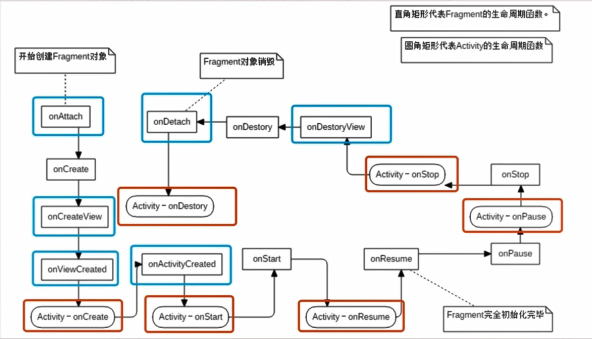

# 第一行代码Android(第3版)

## 第1章 开始启程，你的第一行Android代码

Android架构

Linux内核层

系统运行库层

应用架构层

应用层

## 第2章 探究新语言，快速入门Kotlin编程

val  是只能赋值一次的变量

var 是可以多次赋值的变量

前面添加 `const` 才能变为真正的常量，或者添加 `@JvmField` 注解

最后一行代码做为表达式的返回值

Kotlin默认所有非抽象类都是不可以被继承的。

主构造函数与次构造函数

主构造函数没有函数体，所有的次构造函数都必须调用主构造函数。

init结构体用于初始化参数

Kotlin的可见性修饰符—— public、private、protected和internal

public为默认的，所有类可见；

private，当前类可见；

protected，当前类、子类可见；

internal，同一模块类可见。

data类，自动添加equals()、hashCode()、toString()等方法；

object类，单例。

#### 2.6 Lambda编程

Lambda表达式的语法结构：{ 参数名1：参数类型, 参数名2：参数类型 -> 函数体 }

函数体最后一行会作为Lambda表达式的返回值。

map函数：可以按照需求对集合中的元素进行任意的映射转换。

filter函数：可以按照需求对集合中的元素进行过滤。

#### 2.7 空指针检查

? 表示可空；

?. 表示当对象不为空的时候执行后面的方法，当对象为空则什么都不做；

?: 表示判断符号左边是否为空，不为空则表达式值为左，为空则为右；

!! 断言左边必不为空，但是后果自负。

let函数：

obj ?.let { obj2 ->

​		// 执行相应的逻辑

} 

#### 2.8 Kotlin中的小魔术

字符串内嵌表达式

```kotlin
	// 直接引用 变量name
	println("hello, $name. nice to meet you!")
```

函数的参数默认值

```kotlin
// 第二个参数可以选择传入，也可以选择不传入
fun printParams(num: Int, str: String = "hello") {
    println("num is $num , str is $str")
}
```


## 第3章 先从看得到的入手， 探究Activity

kotlin-android-extensions插件，自动生成与控件具有相同名称的变量。

显示Intent：通过包名和类名启动

隐式Intent：通过Action和Category启动

#### 3.4 Activity的生命周期

返回栈 系统总是显示处于栈顶的Activity给用户。

完整生存期 onCreate() -> onDestroy()

可见生存期 onStart() -> onStop()

前台生存期 onResume() -> onPause()

#### 3.5 Activity的启动模式

stand： 默认启动模式。每当启动一个新的Activity时，它就会在返回栈中入栈，并处于栈顶的位置；

singleTop：在启动Activity时如果发现返回栈的栈顶已经是该Activity，则认为可以直接使用它，不会再创建新的Activity实例；

singleTask：每次启动该Activity时，系统会首先在返回栈中检查是否存在该Activity的实例，如果发现已经存在则直接使用该实例，并把在这个Activity之上的所有其他Activity统统出栈，如果没有发现就会创建一个新的Activity实例。

singleInstance：启用一个新的返回栈来管理该Activity。

#### 3.7 Kotlin 课堂：标准函数和静态方法

with函数：可以在连续调用同一个对象的多个方法时让代码变得更加精简。

run函数：和with用法类似，只是需要调用某个对象的run函数。

apply函数：和with用法类似，只是不会将最后一行做为返回值。

###### 静态方法

```kotlin
class Util {

    fun doAction1() {
        println("do action1")
    }

	// 伴生类 companion
    companion object {
		// 静态方法：添加注解
        @JvmStatic
        fun doAction2() {
            println("do action2")
        }
    }
}
// 静态方法：顶层方法 Kotlin编译器会将所有的顶层方法全部编译成静态方法
fun doAction3() {
    println("do action2")
}
```


## 第4章 软件也要拼脸蛋，UI开发的点点滴滴

#### 4.3 详解3种布局

###### LinearLayout

android:gravity 用于指定文字在控件中的对齐方式

android:layout_gravity 用于指定控件在布局中的对齐方式

android:layout_weight 属性

系统会把LinearLayout下所有指定的layout_weight值相加，得到一个总值，然后每个控件所占大小的比例就是用该layout_weight值除以刚才算出的总值。

###### RelativeLayout

layout_above 和 layout_below

layout_toLeftof 和 layout_toRightof

layout_alignLeft、layout_alignRight、layout_alignTop和layout_alignBottom

FrameLayout

#### 4.5 最常用和最难用的控件：ListView

提升ListView的运行效率

```kotlin
class FruitAdapter(activity: Activity, val resourceId: Int, data: List<Fruit>) : ArrayAdapter<Fruit>(activity, resourceId, data) {

    override fun getView(position: Int, convertView: View?, parent: ViewGroup): View {
        val view: View
        val viewHolder: ViewHolder
        // convertView 用于将之前加载好的布局进行缓存，以便之后重用
        if (convertView == null) {
            view = LayoutInflater.from(context).inflate(resourceId, parent, false)
            val fruitImage: ImageView = view.findViewById(R.id.fruitImage)
            val fruitName: TextView = view.findViewById(R.id.fruitName)
            viewHolder = ViewHolder(fruitImage, fruitName)
            view.tag = viewHolder
        } else {
            view = convertView
            viewHolder = view.tag as ViewHolder
        }

        val fruit = getItem(position) // 获取当前项的Fruit实例
        if (fruit != null) {
            viewHolder.fruitImage.setImageResource(fruit.imageId)
            viewHolder.fruitName.text = fruit.name
        }
        return view
    }
	// 定义内部类
    inner class ViewHolder(val fruitImage: ImageView, val fruitName: TextView)

}
```

#### 4.6 更强大的滚动控件：RecyclerView

```kotlin
class FruitAdapter(val fruitList: List<Fruit>) : RecyclerView.Adapter<FruitAdapter.ViewHolder>() {

    inner class ViewHolder(view: View) : RecyclerView.ViewHolder(view) {
        val fruitImage: ImageView = view.findViewById(R.id.fruitImage)
        val fruitName: TextView = view.findViewById(R.id.fruitName)
    }

    override fun onCreateViewHolder(parent: ViewGroup, viewType: Int): ViewHolder {
        val view = LayoutInflater.from(parent.context).inflate(R.layout.fruit_item, parent, false)
        val viewHolder = ViewHolder(view)
        viewHolder.itemView.setOnClickListener {
            val position = viewHolder.adapterPosition
            val fruit = fruitList[position]
            Toast.makeText(parent.context, "you clicked view ${fruit.name}", Toast.LENGTH_SHORT).show()
        }
        viewHolder.fruitImage.setOnClickListener {
            val position = viewHolder.adapterPosition
            val fruit = fruitList[position]
            Toast.makeText(parent.context, "you clicked image ${fruit.name}", Toast.LENGTH_SHORT).show()
        }
        return viewHolder
    }
	// 用于对RecyclerView的子项的数据进行赋值
    override fun onBindViewHolder(holder: ViewHolder, position: Int) {
        val fruit = fruitList[position]
        holder.fruitImage.setImageResource(fruit.imageId)
        holder.fruitName.text = fruit.name
    }

    override fun getItemCount() = fruitList.size

}
```

#### 4.7 编写界面的最佳实践

###### 制作 9-Patch 图片

9-Patch 图片：一种能够指定哪些区域能被拉伸、哪些区域不能的图片。


#### 4.8 Kotlin 课堂：延迟初始化和密封类

###### 对变量延迟初始化

```kotlin
// lateinit 告诉编译器会在晚一些时候对这个变量进行初始化
// 在调用前必须进行初始化，否则会崩溃报错
private lateinit var adapter: MsgAdapter
```

###### 使用密封类优化代码

```kotlin
// 密封类 在使用when语句时，kotlin编译器会检查密封类有哪些子类，并强制要求处理每一种子类
sealed class Result

class Success(val msg: String) : Result()

class Failure(val error: Exception) : Result()


fun getResultMsg(result: Result) = when (result) {
    is Success -> result.msg
    is Failure -> "Error is ${result.error.message}"
}
```


## 第5章 手机平板要兼顾，探究Fragment

#### 5.2 Fragment的使用时

动态添加Fragment

```kotlin
    private fun replaceFragment(fragment: Fragment) {
        val fragmentManager = supportFragmentManager
        // 开启一个事务
        val transaction = fragmentManager.beginTransaction()
        transaction.replace(R.id.rightLayout, fragment)
        // 实现Fragment返回效果
//        transaction.addToBackStack(null)
        transaction.commit()
    }
```

Fragment和Activity之间的通信

```kotlin
// Activity中获取指定的Fragment
val fragment = supportFragmentManager.findFragmentById(R.id.leftFrag) as LeftFragment
// Fragment中getActivity()
activity
```

#### 5.3 Fragment的生命周期



onAttach 和 onDetach

onCreate 和 onDestroy

onCreateView 和 onDestroyView

onViewCreated

onActivityCreated

onStart 和 onStop

onResume 和 onPause

在Activity创建之前，Fragment流程比Activity早；Activity创建之后，Fragment流程比Activity晚；但是Fragment比Activity早销毁。

#### 5.6 Kotlin课堂：扩展函数和运算符重载

1. 建议：向哪个类添加扩展函数就定义一个同名的Kotlin文件
2. 将扩展函数定义成顶层方法，可以让扩展函数有全局的访问域
3. 语法糖: 运算符重载(需要指定函数)

```kotlin
class Obj {
	operator fun plus(obj: Obj): Obj {
		// 处理逻辑		
	}
}
```

关键字 `operator` 和函数名 `plus` 是固定不变的，接收的参数和返回的值可以自定义

可以对同一个运算符进行多重重载

```kotlin
class Money(val value: Int) {

    operator fun plus(money: Money): Money {
        val sum = value + money.value
        return Money(sum)
    }

    operator fun plus(newValue: Int): Money {
        val sum = value + newValue
        return Money(sum)
    }
}
```

4. 语法糖表达式和实际调用函数对照表

一元前缀操作符

| 表达式 | 实际调用函数     |
| :----- | :--------------- |
| `+a`   | `a.unaryPlus()`  |
| `-a`   | `a.unaryMinus()` |
| `!a`   | `a.not()`        |

递增与递减

| 表达式 | 实际调用函数       |
| :----- | :----------------- |
| `a++`  | `a.inc()` + 见下文 |
| `a--`  | `a.dec()` + 见下文 |

算术运算符

| 表达式  | 实际调用函数   |
| :------ | :------------- |
| `a + b` | `a.plus(b)`    |
| `a - b` | `a.minus(b)`   |
| `a * b` | `a.times(b)`   |
| `a / b` | `a.div(b)`     |
| `a % b` | `a.rem(b)`     |
| `a..b`  | `a.rangeTo(b)` |

“In”操作符

| 表达式    | 实际调用函数     |
| :-------- | :--------------- |
| `a in b`  | `b.contains(a)`  |
| `a !in b` | `!b.contains(a)` |

索引访问操作符

| 表达式                | 实际调用函数             |
| :-------------------- | :----------------------- |
| `a[i]`                | `a.get(i)`               |
| `a[i, j]`             | `a.get(i, j)`            |
| `a[i_1, ……, i_n]`     | `a.get(i_1, ……, i_n)`    |
| `a[i] = b`            | `a.set(i, b)`            |
| `a[i, j] = b`         | `a.set(i, j, b)`         |
| `a[i_1, ……, i_n] = b` | `a.set(i_1, ……, i_n, b)` |

调用操作符

| 表达式            | 实际调用函数             |
| :---------------- | :----------------------- |
| `a()`             | `a.invoke()`             |
| `a(i)`            | `a.invoke(i)`            |
| `a(i, j)`         | `a.invoke(i, j)`         |
| `a(i_1, ……, i_n)` | `a.invoke(i_1, ……, i_n)` |

广义赋值

| 表达式   | 实际调用函数       |
| :------- | :----------------- |
| `a += b` | `a.plusAssign(b)`  |
| `a -= b` | `a.minusAssign(b)` |
| `a *= b` | `a.timesAssign(b)` |
| `a /= b` | `a.divAssign(b)`   |
| `a %= b` | `a.remAssign(b)`   |

相等与不等操作符

| 表达式   | 实际调用函数                      |
| :------- | :-------------------------------- |
| `a == b` | `a?.equals(b) ?: (b === null)`    |
| `a != b` | `!(a?.equals(b) ?: (b === null))` |

比较操作符

| 表达式   | 实际调用函数          |
| :------- | :-------------------- |
| `a > b`  | `a.compareTo(b) > 0`  |
| `a < b`  | `a.compareTo(b) < 0`  |
| `a >= b` | `a.compareTo(b) >= 0` |
| `a <= b` | `a.compareTo(b) <= 0` |

## 第6章 全局大喇叭，详解广播机制

#### 6.1 广播机制简介

标准广播：异步执行 所有BroadcastReceiver几乎同时收到广播 无法拦截

有序广播：同步执行 上一级处理完后才到下一级处理 可以拦截

#### 6.2 接收系统广播

静态注册：XML注册 开机有效 隐式广播不可(8.0后)

动态注册：代码注册 注册有效 手动注销 

完整系统广播列表：

```
<Android SDK>/platforms/<Android Api版本>/data/broadcast_actions.txt
```

***注意*** ：

不要在广播的onReceive( )方法中进行耗时操作，广播是运行在主线程，长时间未响应会导致ANR。

同时在BroadcastReceiver中创建子线程进行操作是不可靠的，其所在进程可能会被杀死

#### 6.3 发送自定义广播

```kotlin
// 发送广播时 指定接收广播的包名
// 否则静态广播无法接收到
intent.setPackage(packageName)
```

```kotlin
// 有序广播通过设置 priority 设置广播接收优先级
abortBroadcast() // 拦截广播
```

#### 6.4 广播最佳实践

在BaseActivity中注册强制下线的广播，不需要在每个Activity都添加接收到强制下线广播弹窗的逻辑

在onResume( )和onPause( )中注册和注销广播可以保证只有栈顶的Activity才能接收到广播

#### 6.5 Kotlin课堂：高阶函数详解

###### 定义高阶函数

函数类型：以传入参数的类型以及返回值类型为分类标准

将函数类型当做参数或者返回值的就是高阶函数

函数类型可以定义到指定类当中，调用高阶函数时，传入的函数自动拥有指定类的上下文

```kotlin
fun StringBuilder.build(block: StringBuilder.() -> Unit): StringBuilder {
    block()
    return this
}
val list = listOf("Apple", "Banana", "Orange", "Pear", "Grape")
val result = StringBuilder().build {
    append("Start eating fruits.\n")
    for (fruit in list) {
        append(fruit).append("\n")
    }
    append("Ate all fruits.")
}
println(result.toString())
// 	  输出结果
//    Start eating fruits.
//    Apple
//    Banana
//    Orange
//    Pear
//    Grape
//    Ate all fruits.
```

###### 内联函数

`inline` 

Kotlin编译器会将内联函数中的代码在编译的时候自动替换到调用它的地方， 减少额外的内存和性能开销

`noinline`

`inline` 会进行函数返回，`noinline` 只能进行局部返回

`crossinline`

禁用 `inline` 函数当中的 `return` ，但是可以继续使用局部返回


## 第7章 数据存储全方案，详细持久化技术

#### 7.1 持久化技术简介

文件存储、SharedPreferences存储以及数据库存储

#### 7.2 文件存储

文件存储： 不对存储数据进行处理  	适合存储简单的文本数据或者二进制数据

###### 写

```kotlin
private fun save(inputText: String) {
    try {
        // 第一个参数为文件名，默认路径为/data/data/<package name>/files/
        // 第二个参数为模式， MODE_PRIVATE 覆盖原文件 MODE_APPEND 追加内容
        val output = openFileOutput("data", Context.MODE_PRIVATE)
        val writer = BufferedWriter(OutputStreamWriter(output))
        // use 内置扩展函数 Lambda表达式内的代码执行完后自动关闭外层的流
        writer.use {
            it.write(inputText)
        }
    } catch (e: IOException) {
        e.printStackTrace()
    }
}
```

###### 读

```kotlin
private fun load(): String {
    val content = StringBuilder()
    try {
        // 参数为文件名，默认路径为/data/data/<package name>/files/
        val input = openFileInput("data")
        val reader = BufferedReader(InputStreamReader(input))
        reader.use {
            // forEachLine 内置扩展函数 将读取到的每行内容回调至Lambda表达式中
            reader.forEachLine {
                content.append(it)
            }
        }
    } catch (e: IOException) {
        e.printStackTrace()
    }
    return content.toString()
}
```

#### 7.3 SharedPreferences存储

SharedPreferences存储： 键值对存储 	根据数据类型存储 	XML格式存储

###### 存

```kotlin
// Context类中的 getSharedPreferences()方法
// 第一个参数指定文件名 默认路径为/data/data/<package name>/shared_prefs/
// 第二个参数指定模式 MODE_PRIVATE 表示只有当前应用可读写
// Activity类中的 getSharedPreferences()方法
// 只接受指定模式参数 名称默认使用当前Activity的类名
val editor = getSharedPreferences("data", Context.MODE_PRIVATE).edit()
// Key-Value
editor.putString("name", "Tom")
editor.putInt("age", 28)
editor.putBoolean("married", false)
editor.apply()
```

###### 取

```kotlin
val prefs = getSharedPreferences("data", Context.MODE_PRIVATE)
// Key - Default
val name = prefs.getString("name", "")
val age = prefs.getInt("age", 0)
val married = prefs.getBoolean("married", false)
```

#### 7.4 SQLite数据库存储

SQLite数据库存储： 适合存储数据量较大、结构较复杂的数据 	数据库格式存储

###### 创

```kotlin
// context 上下文
// name 数据库名称
// null 自定义Cursor
// version 数据库版本号 version >= 1
// 数据库文件默认路径：/data/data/<package name>/databases/
class MyDatabaseHelper(val context: Context, name: String, version: Int) :
    SQLiteOpenHelper(context, name, null, version) {

    // 数据库库类型 integer 整型 real 浮点型 text 文本类型 blob 二进制类型
    // primary key 主键 autoincrement 自增长。
    private val createBook = "create table Book (" +
            " id integer primary key autoincrement," +
            "author text," +
            "price real," +
            "pages integer," +
            "name text," +
            "category_id integer)"

    override fun onCreate(db: SQLiteDatabase) {
        db.execSQL(createBook)
        Toast.makeText(context, "Create succeeded", Toast.LENGTH_SHORT).show()
    }

    override fun onUpgrade(db: SQLiteDatabase, oldVersion: Int, newVersion: Int) {
    }
}

val dbHelper = MyDatabaseHelper(this, "BookStore.db", 1)
// 当表不存在时创建表，表存在则获取表
dbHelper.writableDatabase
```

###### 升

```kotlin
class MyDatabaseHelper(val context: Context, name: String, version: Int) :
    SQLiteOpenHelper(context, name, null, version) {

    private val createBook = "create table Book (" +
            " id integer primary key autoincrement," +
            "author text," +
            "price real," +
            "pages integer," +
            "name text," +
            "category_id integer)"

    private val createCategory = "create table Category (" +
            "id integer primary key autoincrement," +
            "category_name text," +
            "category_code integer)"

    override fun onCreate(db: SQLiteDatabase) {
        db.execSQL(createBook)
        db.execSQL(createCategory)
        Toast.makeText(context, "Create succeeded", Toast.LENGTH_SHORT).show()
    }
	// newVersion > oldVersion 时执行
    override fun onUpgrade(db: SQLiteDatabase, oldVersion: Int, newVersion: Int) {
        // 如果表存在则删除
        db.execSQL("drop table if exists Book")
        db.execSQL("drop table if exists Category")
        onCreate(db)
    }
}

val dbHelper = MyDatabaseHelper(this, "BookStore.db", 2)
dbHelper.writableDatabase
```

###### 增

```kotlin
val db = dbHelper.writableDatabase
val values1 = ContentValues().apply {
    // 开始组装第一条数据
    put("name", "The Da Vinci Code")
    put("author", "Dan Brown")
    put("pages", 454)
    put("price", 16.96)
}
// insert(String table, String nullColumnHack, ContentValues values)
// table 表名
// nullColumnHack 在未指定添加数据时为指定空列赋值NULL， 一般填null
// values ContentValues对象
db.insert("Book", null, values1) // 插入第一条数据
val values2 = ContentValues().apply {
    // 开始组装第二条数据
    put("name", "The Lost Symbol")
    put("author", "Dan Brown")
    put("pages", 510)
    put("price", 19.95)
}
db.insert("Book", null, values2) // 插入第二条数据
```

###### 改

```kotlin
val db = dbHelper.writableDatabase
val values = ContentValues()
values.put("price", 10.99)
// update(String table, ContentValues values, String whereClause, String[] whereArgs)
// table 表名
// values ContentValues对象
// whereClause 更新指定参数的行
// whereArgs 指定的参数
val rows = db.update("Book", values, "name = ?", arrayOf("The Da Vinci Code"))
```

###### 删

```kotlin
val db = dbHelper.writableDatabase
// delete(String table, String whereClause, String[] whereArgs)
// table 表名
// whereClause 指定参数的行
// whereArgs 指定的参数
db.delete("Book", "pages > ?", arrayOf("500"))
```

###### 查

```kotlin
query(String table, String[] columns, String selection,
      String[] selectionArgs, String groupBy, String having,
      String orderBy)
```

| query方法参数 | 对应SQL的部分             | 描述                          |
| ------------- | ------------------------- | ----------------------------- |
| table         | from table_name           | 指定查询的表名                |
| columns       | select column1, column2   | 指定查询的列名                |
| selection     | where column = value      | 指定where的约束条件           |
| selectionArgs | -                         | 为where中的占位符提供具体的值 |
| groupBy       | group by column           | 指定需要的group by的列        |
| having        | having column = value     | 对group by后的结果进一步约束  |
| orderBy       | order by column1, column2 | 指定查询结果的排序方式        |

```kotlin
val db = dbHelper.writableDatabase
// 查询Book表中所有的数据
val cursor = db.query("Book", null, null, null, null, null, null)
if (cursor.moveToFirst()) {
    do {
        // 遍历Cursor对象，取出数据并打印
        val name = cursor.getString(cursor.getColumnIndex("name"))
        val author = cursor.getString(cursor.getColumnIndex("author"))
        val pages = cursor.getInt(cursor.getColumnIndex("pages"))
        val price = cursor.getDouble(cursor.getColumnIndex("price"))
        Log.d("MainActivity", "book name is $name")
        Log.d("MainActivity", "book author is $author")
        Log.d("MainActivity", "book pages is $pages")
        Log.d("MainActivity", "book price is $price")
    } while (cursor.moveToNext())
}
cursor.close()
```

###### 使用SQL操作数据库

添加数据：

```kotlin
db.execSQL(
    "insert into Book (name, author, pages, price) values(?, ?, ?, ?)",
    arrayOf("The Da Vinci Code", "Dan Brown", "454", "16.96")
)
```

更新数据：

```kotlin
db.execSQL(
    "update Book set price = ? where name = ?",
    arrayOf("10.99", "The Da Vinci Code")
)
```

删除数据：

```kotlin
db.execSQL("delete from Book where paged > ?", arrayOf("500"))
```

查询数据：

```kotlin
val cursor = db.rawQuery("select * from Book", null)
```

#### 7.5 SQLite数据库的最佳实践

事务：保证一系列的操作要么全部成功，要么一个都不会完成。

```kotlin
val db = dbHelper.writableDatabase
db.beginTransaction() // 开启事务
try {
    db.delete("Book", null, null)
    if (true) {
        // 在这里手动抛出一个异常，让事务失败
        throw NullPointerException()
    }
    val values = cvOf(
        "name" to "Game of Thrones",
        "author" to "George Martin",
        "pages" to 720,
        "price" to 20.85
    )
    db.insert("Book", null, values)
    db.setTransactionSuccessful() // 事务已经执行成功
} catch (e: Exception) {
    e.printStackTrace()
} finally {
    db.endTransaction() // 结束事务
}
```

数据库版本更新：

```kotlin
class MyDatabaseHelper(val context: Context, name: String, version: Int) :
    SQLiteOpenHelper(context, name, null, version) {

    private val createBook = "create table Book (" +
            " id integer primary key autoincrement," +
            "author text," +
            "price real," +
            "pages integer," +
            "name text," +
            "category_id integer)"

    private val createCategory = "create table Category (" +
            "id integer primary key autoincrement," +
            "category_name text," +
            "category_code integer)"

    override fun onCreate(db: SQLiteDatabase) {
        db.execSQL(createBook)
        db.execSQL(createCategory)
        Toast.makeText(context, "Create succeeded", Toast.LENGTH_SHORT).show()
    }

    override fun onUpgrade(db: SQLiteDatabase, oldVersion: Int, newVersion: Int) {
        // 新增一张表
        if (oldVersion <= 1) {
            db.execSQL(createCategory)
        }
        // 原有表新增列
        if (oldVersion <= 2) {
            db.execSQL("alter table Book add column category_id integer")
        }
    }
}
```

#### 7.6 Kotlin课堂：高阶函数的应用

###### 例1： SharedPreferences使用简化

```kotlin
// open函数内拥有SharedPreferences.Editor的上下文
fun SharedPreferences.edit(block: SharedPreferences.Editor.() -> Unit) {
    val editor = edit()
    editor.block()
    editor.apply()
}
```

7.3中的存可以简化成以下代码：

```kotlin
getSharedPreferences("data", Context.MODE_PRIVATE).edit {
    putString("name", "Tom")
    putInt("age", 28)
    putBoolean("married", false)
}
```

###### 例2： ContentValues使用简化

```kotlin
// Pair 键值对
// vararg 可变参数列表 允许传入任意多个Pair类型参数
// Lambda表达式内获取到ContentValues的上下文
fun cvOf(vararg pairs: Pair<String, Any?>) = ContentValues().apply {
    for (pair in pairs) {
        val key = pair.first
        val value = pair.second
        when (value) {
            is Int -> put(key, value)
            is Long -> put(key, value)
            is Short -> put(key, value)
            is Float -> put(key, value)
            is Double -> put(key, value)
            is Boolean -> put(key, value)
            is String -> put(key, value)
            is Byte -> put(key, value)
            is ByteArray -> put(key, value)
            null -> putNull(key)
        }
    }
}
```

7.4 中的增可以简化成以下代码：

```kotlin
val values = cvOf(
    "name" to "Game of Thrones",
    "author" to "George Martin",
    "pages" to 720,
    "price" to 20.85
)
db.insert("Book", null, values)
```


## 第8章 跨程序共享数据，探究ContentProvider

#### 8.1 ContentProvider简介

ContentProvider 不同程序之间的数据共享 可以保证被访问数据的安全性 可以指定部分数据进行共享

ContentProvider的用法：

1. 使用现有的ContentProvider读取和操作相应程序中的数据
2. 创建自己的ContentProvider，给程序的数据提供外部访问接口

#### 8.2 运行时权限

###### 权限分类

普通权限：除了危险权限，剩余的大多是普通权限

危险权限：Android 10中一共11组30个危险权限

| 权限组                 | 权限                                                         |
| :--------------------- | :----------------------------------------------------------- |
| `CALENDAR`             | `READ_CALENDAR` `WRITE_CALENDAR`                             |
| `CAMERA`               | `CAMERA`                                                     |
| `CONTACTS`             | `READ_CONTACTS` `WRITE_CONTACTS` `GET_ACCOUNTS`              |
| `LOCATION`             | `ACCESS_FINE_LOCATION` `ACCESS_COARSE_LOCATION`              |
| `MICROPHONE`           | `RECORD_AUDIO`                                               |
| `PHONE`                | `READ_PHONE_STATE` `CALL_PHONE` `READ_CALL_LOG` `WRITE_CALL_LOG` `ADD_VOICEMAIL` `USE_SIP` `PROCESS_OUTGOING_CALLS` |
| `SENSORS`              | `BODY_SENSORS`                                               |
| `ACTIVITY_RECOGNITION` | `ACTIVITY_RECOGNITION`                                       |
| `SMS`                  | `SEND_SMS` `RECEIVE_SMS` `READ_SMS` `RECEIVE_WAP_PUSH` `RECEIVE_MMS` |
| `STORAGE`              | `READ_EXTERNAL_STORAGE` `WRITE_EXTERNAL_STORAGE`             |

特殊权限：使用相对较少

***注意*** 用户一旦同意了某个权限的申请后，同组的其他权限会被系统默认授予。但是，Android系统的权限分组随时可能会调整。

###### 申请权限

```kotlin
override fun onRequestPermissionsResult(requestCode: Int, permissions: Array<String>,
                                        grantResults: IntArray) {
    super.onRequestPermissionsResult(requestCode, permissions, grantResults)
    when (requestCode) {
        1 -> {
            if (grantResults.isNotEmpty()
                    && grantResults[0] == PackageManager.PERMISSION_GRANTED) {
                call()
            } else {
                // 如果用户拒绝授权，提示
                Toast.makeText(this, "You denied the permission", Toast.LENGTH_SHORT).show()
            }
        }
    }
}

// 先判断权限是否已授予
if (ContextCompat.checkSelfPermission(this, Manifest.permission.CALL_PHONE)
        != PackageManager.PERMISSION_GRANTED) {
    ActivityCompat.requestPermissions(this,
            arrayOf(Manifest.permission.CALL_PHONE), 1)
} else {
    // 打电话
    call()
}
```

#### 8.3 访问其他程序中的数据

访问ContentProvider一般需要借助ContentResolver，通过Context中的getContentResolver()获取。

ContentResolver使用方式与SQLite类似，同样有增删改查操作，使用方式类似。

```kotlin
insert(Uri uri, ContentValues values)
delete(Uri uri, String where, String[] selectionArgs)
update(Uri uri, ContentValues values, String where, String[] selectionArgs)
query(Uri uri, String[] projection, String selection, String[] selectionArgs, String sortOrder)
```

| 方法参数      | 对应SQL的部分             | 描述                             |
| ------------- | ------------------------- | -------------------------------- |
| uri           | from table_name           | 指定查询某个应用程序下的某一张表 |
| projection    | select column1, column2   | 指定查询的列名                   |
| selection     | where column = value      | 指定where的约束条件              |
| selectionArgs | -                         | 为where中的占位符提供具体的值    |
| sortOrder     | order by column1, column2 | 指定查询结果的排序方式           |

Uri：内容URI，唯一标识符。主要由 `authority` 和 `path` 两部分组成。

`authority `是用于对不同的应用程序做区分的，一般使用包名。`path ` 则是用于对同一应用的不同表做区分的。

```kotlin
// Uri的标准格式
content://authority/path
eg. content://com.example.app.provider/table1
// 解析成Uri对象
val uri = Uri.parse("content://com.example.app.provider/table1")
```

###### 例：读取系统联系人

```kotlin
// 需要申请运行时权限
private fun readContacts() {
    // 查询联系人数据
    // 使用?.和apply()简化代码
    contentResolver.query(
        ContactsContract.CommonDataKinds.Phone.CONTENT_URI,
        null, null, null, null
    )?.apply {
        while (moveToNext()) {
            // 获取联系人姓名
            val displayName =
                getString(getColumnIndex(ContactsContract.CommonDataKinds.Phone.DISPLAY_NAME))
            // 获取联系人手机号
            val number =
                getString(getColumnIndex(ContactsContract.CommonDataKinds.Phone.NUMBER))
            contactsList.add("$displayName\n$number")
        }
        adapter.notifyDataSetChanged()
        close()
    }
}
```

#### 8.4 创建自己的ContentProvider

###### 创建ContentProvider的步骤

需要在AndroidManifest.xml添加

```xml
<!--  enabled 表示启用与否  exported 表示允许其他访问与否	-->
<provider
    android:name=".DatabaseProvider"
    android:authorities="com.example.databasetest.provider"
    android:enabled="true"
    android:exported="true" />
```

新建一个类并继承ContentProvider

```kotlin
class MyProvider : ContentProvider() {

    // 完成对数据库的创建和升级，true表示初始化完成，false表示失败
    override fun onCreate(): Boolean {
        return false
    }

    override fun query(
        uri: Uri, projection: Array<String>?, selection: String?,
        selectionArgs: Array<String>?, sortOrder: String?
    ): Cursor? {
        return null
    }

    override fun insert(uri: Uri, values: ContentValues?): Uri? {
        return null
    }

    override fun update(
        uri: Uri, values: ContentValues?, selection: String?, selectionArgs: Array<String>?
    ): Int {
        return 0
    }

    override fun delete(
        uri: Uri, selection: String?, selectionArgs: Array<String>?
    ): Int {
        return 0
    }

    // 根据传入的Uri返回相应的MIME类型
    override fun getType(uri: Uri) = when (uriMatcher.match(uri)) {
        return null
    }
}
```

Uri格式：

```kotlin
// 标准格式 表明期望访问该表中所有的数据
content://com.example.app.provider/table1
// 指定id 表明期望访问的是应用com.example.app.provider表table1中id为1的数据
content://com.example.app.provider/table1/1
```

可以使用通配符进行匹配：(用于match( ))

- *表示匹配任意长度的的任意字符
- #表示匹配任意长度的数字

```kotlin
// 匹配任意表的内容的Uri
content://com.example.app.provider/*
// 匹配table1表中任意一行数据的内容Uri
content://com.example.app.provider/table1/#
```

UriMatcher类：

```kotlin
// code 自定义代码
// 用于将URI与code联系起来
addURI(String authority, String path, int code)
// 传入的Uri，返回code
match(Uri uri)
```

```kotlin
init {
    uriMatcher.addURI("com.example.app.provider", "table1", table1Dir)
    uriMatcher.addURI("com.example.app.provider ", "table1/#", table1Item)
    uriMatcher.addURI("com.example.app.provider ", "table2", table2Dir)
    uriMatcher.addURI("com.example.app.provider ", "table2/#", table2Item)
}

override fun query(
    uri: Uri, projection: Array<String>?, selection: String?,
    selectionArgs: Array<String>?, sortOrder: String?
): Cursor? {
    when (uriMatcher.match(uri)) {
        table1Dir -> {
            // 查询table1表中的所有数据
        }
        table1Item -> {
            // 查询table1表中的单条数据
        }
        table2Dir -> {
            // 查询table2表中的所有数据
        }
        table2Item -> {
            // 查询table2表中的单条数据
        }
    }
    return null
}
```

MIME字符串：

- 必须以 `vnd.` 开头
- 如果内容URI以路径结尾，则后接 `android.cursor.dir/` ；如果内容以id结尾，则后接 `android.cursor.item/` 。
- 最后接上 `vnd.<authority>.<path>` 。

```kotlin
// content://com.example.app.provider/table1的MIME类型
vnd.android.cursor.dir/vnd.com.example.app.provider.table1
// content://com.example.app.provider/table1/1的MIME类型
vnd.android.cursor.item/vnd.com.example.app.provider.table1
```

***注意*** 所有的增删改查操作必须匹配到相应的URI格式才能进行。

###### 实现跨程序数据共享

```kotlin
class DatabaseProvider : ContentProvider() {

    private val bookDir = 0
    private val bookItem = 1
    private val categoryDir = 2
    private val categoryItem = 3
    private val authority = "com.example.databasetest.provider"
    private var dbHelper: MyDatabaseHelper? = null

    // by lazy 懒加载 只有当uriMatcher变量首次被调用的时候才会执行
    private val uriMatcher by lazy {
        val matcher = UriMatcher(UriMatcher.NO_MATCH)
        matcher.addURI(authority, "book", bookDir)
        matcher.addURI(authority, "book/#", bookItem)
        matcher.addURI(authority, "category", categoryDir)
        matcher.addURI(authority, "category/#", categoryItem)
        matcher
    }

    // context判空，为空则返回false，不会空执行Lambda表达式内的语句
    // 将表达式内最后一行作为返回值
    override fun onCreate() = context?.let {
        dbHelper = MyDatabaseHelper(it, "BookStore.db", 2)
        true
    } ?: false

    override fun query(
        uri: Uri,
        projection: Array<String>?,
        selection: String?,
        selectionArgs: Array<String>?,
        sortOrder: String?
    ) = dbHelper?.let {
        // 查询数据
        val db = it.readableDatabase
        val cursor = when (uriMatcher.match(uri)) {
            bookDir -> db.query("Book", projection, selection, selectionArgs, null, null, sortOrder)
            bookItem -> {
                // pathSegments 根据分隔符分割 0为path 1为id
                val bookId = uri.pathSegments[1]
                db.query("Book", projection, "id = ?", arrayOf(bookId), null, null, sortOrder)
            }
            categoryDir -> db.query(
                "Category",
                projection,
                selection,
                selectionArgs,
                null,
                null,
                sortOrder
            )
            categoryItem -> {
                val categoryId = uri.pathSegments[1]
                db.query(
                    "Category",
                    projection,
                    "id = ?",
                    arrayOf(categoryId),
                    null,
                    null,
                    sortOrder
                )
            }
            else -> null
        }
        cursor
    }

    // insert需要返回一个能够表示新增数据的URI
    override fun insert(uri: Uri, values: ContentValues?) = dbHelper?.let {
        // 添加数据
        val db = it.writableDatabase
        val uriReturn = when (uriMatcher.match(uri)) {
            bookDir, bookItem -> {
                val newBookId = db.insert("Book", null, values)
                Uri.parse("content://$authority/book/$newBookId")
            }
            categoryDir, categoryItem -> {
                val newCategoryId = db.insert("Category", null, values)
                Uri.parse("content://$authority/category/$newCategoryId")
            }
            else -> null
        }
        uriReturn
    }

    override fun update(
        uri: Uri,
        values: ContentValues?,
        selection: String?,
        selectionArgs: Array<String>?
    ) =
        dbHelper?.let {
            // 更新数据
            val db = it.writableDatabase
            val updatedRows = when (uriMatcher.match(uri)) {
                bookDir -> db.update("Book", values, selection, selectionArgs)
                bookItem -> {
                    val bookId = uri.pathSegments[1]
                    db.update("Book", values, "id = ?", arrayOf(bookId))
                }
                categoryDir -> db.update("Category", values, selection, selectionArgs)
                categoryItem -> {
                    val categoryId = uri.pathSegments[1]
                    db.update("Category", values, "id = ?", arrayOf(categoryId))
                }
                else -> 0
            }
            updatedRows
        } ?: 0

    override fun delete(uri: Uri, selection: String?, selectionArgs: Array<String>?) =
        dbHelper?.let {
            // 删除数据
            val db = it.writableDatabase
            val deletedRows = when (uriMatcher.match(uri)) {
                bookDir -> db.delete("Book", selection, selectionArgs)
                bookItem -> {
                    val bookId = uri.pathSegments[1]
                    db.delete("Book", "id = ?", arrayOf(bookId))
                }
                categoryDir -> db.delete("Category", selection, selectionArgs)
                categoryItem -> {
                    val categoryId = uri.pathSegments[1]
                    db.delete("Category", "id = ?", arrayOf(categoryId))
                }
                else -> 0
            }
            deletedRows
        } ?: 0

    override fun getType(uri: Uri) = when (uriMatcher.match(uri)) {
        bookDir -> "vnd.android.cursor.dir/vnd.com.example.databasetest.provider.book"
        bookItem -> "vnd.android.cursor.item/vnd.com.example.databasetest.provider.book"
        categoryDir -> "vnd.android.cursor.dir/vnd.com.example.databasetest.provider.category"
        categoryItem -> "vnd.android.cursor.item/vnd.com.example.databasetest.provider.category"
        else -> null
    }
}
```

对上述ContentProvider进行操作：

```kotlin
addData.setOnClickListener {
    // 添加数据
    val uri = Uri.parse("content://com.example.databasetest.provider/book")
    val values = contentValuesOf("name" to "A Clash of Kings", "author" to "George Martin", "pages" to 1040, "price" to 22.85)
    val newUri = contentResolver.insert(uri, values)
    bookId = newUri?.pathSegments?.get(1)
}
queryData.setOnClickListener {
    // 查询数据
    val uri = Uri.parse("content://com.example.databasetest.provider/book")
    contentResolver.query(uri, null, null, null, null)?.build {
        while (moveToNext()) {
            val name = getString(getColumnIndex("name"))
            val author = getString(getColumnIndex("author"))
            val pages = getInt(getColumnIndex("pages"))
            val price = getDouble(getColumnIndex("price"))
            Log.d("MainActivity", "book name is $name")
            Log.d("MainActivity", "book author is $author")
            Log.d("MainActivity", "book pages is $pages")
            Log.d("MainActivity", "book price is $price")
        }
        close()
    }
}
updateData.setOnClickListener {
    // 更新数据
    bookId?.let {
        val uri = Uri.parse("content://com.example.databasetest.provider/book/$it")
        val values = contentValuesOf("name" to "A Storm of Swords", "pages" to 1216, "price" to 24.05)
        contentResolver.update(uri, values, null, null)
    }
}
deleteData.setOnClickListener {
    // 删除数据
    bookId?.let {
        val uri = Uri.parse("content://com.example.databasetest.provider/book/$it")
        contentResolver.delete(uri, null, null)
    }
}
```

#### 8.5 Kotlin课堂：泛型和委托

###### 泛型的基本用法

泛型：在一般的编程模式下，我们需要给任何一个变量指定一个具体的类型，而泛型允许我们在不指定具体类型的情况下进行编程，这样编写出来的代码拥有更好的扩展性。

泛型定义方式：

- 定义泛型类
- 定义泛型方法

语法结构 `<T>` ，T并不固定，只是约定俗成，可以替换成任意英文字母或单词。

```kotlin
// 定义泛型类
class Myclass<T> {

    fun method(param: T): T {
        return param
    }
}
val myClass = MyClass<Int>()
val result = myClass.method(123)

// 定义泛型方法
class MyClass {

    fun <T> method(param: T): T {
        return param
    }
}
val myClass = MyClass()
val result = myClass.method<Int>(123)
// 可以自动推导类型
val results = myClass.method(123)
```

泛型可以设置泛型上界来对泛型的类型进行约束。

```kotlin
class MyClass {

    fun <T: Number> method(param: T): T {
        return param
    }
}
```

###### 委托

委托是一种设计模式，基本理念是：操作对象自己不去处理某段逻辑，而是会把工作委托给另一个辅助对象去处理。

- 类委托

核心思想是将一个类的具体实现委托给另一个类去完成。

```kotlin
class MySet<T>(val helperSet: HashSet<T>) : Set<T> by helperSet {

    override val size: Int
        get() = helperSet.size

    override fun contains(element: T) = helperSet.contains(element)

    override fun containsAll(elements: Collection<T>) = helperSet.containsAll(elements)

    override fun isEmpty() = helperSet.isEmpty()

    override fun iterator(): Iterator<T> = helperSet.iterator()
}
```

MySet的构造函数接收了一个HashSet参数，这便是辅助对象。然后Set接口的所有方法实现都是调用了辅助对象的相应方法，这边是一种委托模式。

类委托的意义：大部分方法的实现调用辅助对象中的方法，少部分的方法由自己来重写，设置加入一些自己独有的方法，让MySet就会成为一个全新的数据结构类。

`by` 关键字， 可以免去模板式代码，上面的例子可以简化成以下内容：

```kotlin
class MySet<T>(val helperSet: HashSet<T>) : Set<T> by helperSet {
}
```

如果需要对某个方法重新实现，只需要单独重写即可。如果需要添加新的方法，直接写就好了。

```kotlin
class MySet<T>(val helperSet: HashSet<T>) : Set<T> by helperSet {

    fun helloWorld() = println("Hello World")

    override fun isEmpty() = false

}
```

- 委托属性

核心思想是将一个属性(字段)的具体实现委托给另一个类去实现。

```kotlin
class MyClass {

    var p by Delegate()
}

class Delegate {

    var propValue: Any? = null

    // 第一个参数指明委托功能可以在什么类中使用
    // 第二个参数是Kotlin中的一个属性操作类
    // <*>表示不知道或者不关心泛型的具体类型
    operator fun getValue(myClass: MyClass, prop: KProperty<*>): Any? {
        return propValue
    }

    // value 的类型必须和getValue()方法返回值的类型一致
    // 当 p 设置为 val 的时候不需要setValue()方法
    operator fun setValue(myClass: MyClass, prop: KProperty<*>, value: Any?) {
        propValue = value
    }
}
```

当调用 `p` 属性的时候回自动调用Delegate类的getValue( )方法，当给 `p` 属性赋值的时候回自动调用Delegate类的setValue( )方法。

委托属性的意义： 懒加载、...

```kotlin
class Later<T>(val block: () -> T) {

    var value: Any? = null

    operator fun getValue(any: Any?, prop: KProperty<*>): T {
        // 如果value为空，则用代码块的返回值
        if (value == null) {
            value = block()
        }
        return value as T
    }
}

fun <T> later(block: () -> T) = Later(block)

// 将uriMatcher属性委托至Later类
private val uriMatcher by later {
    val matcher = UriMatcher(UriMatcher.NO_MATCH)
    matcher.addURI(authority, "book", bookDir)
    matcher.addURI(authority, "book/#", bookItem)
    matcher.addURI(authority, "category", categoryDir)
    matcher.addURI(authority, "category/#", categoryItem)
    matcher
}
```


## 第9章 丰富你的程序，运用手机多媒体

#### 9.1 将程序运行到手机上

现在Android手机早就不是什么稀罕物，几乎人手一部了，***如果***你还没有的话，赶紧去购买吧。

#### 9.2 使用通知

###### 创建通知渠道

Android 8.0系统引入通知渠道。

通知渠道一旦创建就不能修改。创建通知渠道前加系统版本判断。重要等级用户可以修改。

通知的重要等级代表的是系统会使用不同的方式通知用户。

```kotlin
val manager = getSystemService(Context.NOTIFICATION_SERVICE) as NotificationManager
if (Build.VERSION.SDK_INT >= Build.VERSION_CODES.O) {
    // 渠道Id， 渠道名称， 重要等级
    // IMPORTANCE_MIN、IMPORTANCE_LOW、IMPORTANCE_DEFAULT、IMPORTANCE_HIGH
    val channel = NotificationChannel("normal", "Normal", NotificationManager.IMPORTANCE_DEFAULT)
    manager.createNotificationChannel(channel)
}
```

###### 通知的基本用法

使用AndroidX库中提供的NotificationCompat类，保证兼容性。

```kotlin
val intent = Intent(this, NotificationActivity::class.java)
// 	第一个参数 上下文， 第二个参数传0， 第三个参数Intent， 第四个参数一般传0
//	getActivity可以替换为getService、getBroadcast
val pi = PendingIntent.getActivity(this, 0, intent, 0)
// 	第一个参数 上下文， 第二个参数 渠道id
val notification = NotificationCompat.Builder(this, "important")
    //  设置通知标题
    .setContentTitle("This is content title")
    //  设置通知正文内容 但是只能显示部分
    .setContentText("Learn how to build notifications, send and sync data, and use voice actions. Get the official Android IDE and developer tools to build apps for Android.")
    //  设置小图标 只能用纯alpha图层图片进行设置 显示在状态栏上
    .setSmallIcon(R.drawable.small_icon)
    //  设置大图标 通知中显示的图标
    .setLargeIcon(BitmapFactory.decodeResource(resources, R.drawable.large_icon))
	//	添加通知点击事件
    .setContentIntent(pi)
	//	当通知被点击后，自动取消通知
    .setAutoCancel(true)
    .build()
//  显示通知 第一个参数 通知id 保证id唯一
manager.notify(1, notification)
//	手动取消通知， 参数为通知id
manager.cancel(1)
```

通知显示长文本和图片

```kotlin
val notification = NotificationCompat.Builder(this, "important")
    //  设置通知标题
    .setContentTitle("This is content title")
    //  设置通知正文内容 但是只能显示部分
//    .setContentText("Learn how to build notifications, send and sync data, and use voice actions. Get the official Android IDE and developer tools to build apps for Android.")
    //  设置通知长文本 
    .setStyle(NotificationCompat.BigTextStyle().bigText("Learn how to build notifications, send and sync data, and use voice actions. Get the official Android IDE and developer tools to build apps for Android."))
    //  设置通知显示图片
    .setStyle(NotificationCompat.BigPictureStyle().bigPicture(BitmapFactory.decodeResource(resources, R.drawable.big_image)))
    .build()
```

#### 9.3 调用摄像头和相册

```kotlin
class MainActivity : AppCompatActivity() {

    val takePhoto = 1
    val fromAlbum = 2
    lateinit var imageUri: Uri
    lateinit var outputImage: File

    override fun onCreate(savedInstanceState: Bundle?) {
        super.onCreate(savedInstanceState)
        setContentView(R.layout.activity_main)
        // 相机拍照
        takePhotoBtn.setOnClickListener {
            // 创建File对象，用于存储拍照后的图片
            // 路径为：/sdcard/Android/data/<package name>/cache/
            outputImage = File(externalCacheDir, "output_image.jpg")
            if (outputImage.exists()) {
                outputImage.delete()
            }
            outputImage.createNewFile()
            // Android 7.0 开始直接使用本地真实路径的Uri被认为不安全 会抛出异常
            // FileProvider是一种特殊的ContentProvider，需要在AndroidManifest中注册
            // 利用ContentProvider的机制来对数据进行保护
            imageUri = if (Build.VERSION.SDK_INT >= Build.VERSION_CODES.N) {
                // authority 可以是任意唯一的字符串
                FileProvider.getUriForFile(this,
                        "com.example.cameraalbumtest.fileprovider", outputImage);
            } else {
                Uri.fromFile(outputImage);
            }
            // 启动相机程序
            val intent = Intent("android.media.action.IMAGE_CAPTURE")
            // 设置相机输出图片的位置
            intent.putExtra(MediaStore.EXTRA_OUTPUT, imageUri)
            startActivityForResult(intent, takePhoto)
        }
        // 相册选择
        fromAlbumBtn.setOnClickListener {
            // 打开文件选择器
            val intent = Intent(Intent.ACTION_OPEN_DOCUMENT)
            intent.addCategory(Intent.CATEGORY_OPENABLE)
            // 设置过滤条件 指定只显示照片
            intent.type = "image/*"
            startActivityForResult(intent, fromAlbum)
        }
    }

    override fun onActivityResult(requestCode: Int, resultCode: Int, data: Intent?) {
        super.onActivityResult(requestCode, resultCode, data)
        when (requestCode) {
            // 相机拍照
            takePhoto -> {
                if (resultCode == Activity.RESULT_OK) {
                    // 将拍摄的照片显示出来
                    val bitmap = BitmapFactory.decodeStream(contentResolver.openInputStream(imageUri))
                    imageView.setImageBitmap(rotateIfRequired(bitmap))
                }
            }
            // 相册选择
            fromAlbum -> {
                if (resultCode == Activity.RESULT_OK && data != null) {
                    data.data?.let { uri ->
                        // 将选择的照片显示
                        // 如果图片过大 需要考虑对图片进行压缩再显示
                        val bitmap = getBitmapFromUri(uri)
                        imageView.setImageBitmap(bitmap)
                    }
                }
            }
        }
    }

    private fun getBitmapFromUri(uri: Uri) =
            contentResolver.openFileDescriptor(uri, "r")?.use {
                BitmapFactory.decodeFileDescriptor(it.fileDescriptor)
            }

    private fun rotateIfRequired(bitmap: Bitmap): Bitmap {
        val exif = ExifInterface(outputImage.path)
        val orientation = exif.getAttributeInt(ExifInterface.TAG_ORIENTATION,
                ExifInterface.ORIENTATION_NORMAL)
        return when (orientation) {
            ExifInterface.ORIENTATION_ROTATE_90 -> rotateBitmap(bitmap, 90)
            ExifInterface.ORIENTATION_ROTATE_180 -> rotateBitmap(bitmap, 180)
            ExifInterface.ORIENTATION_ROTATE_270 -> rotateBitmap(bitmap, 270)
            else -> bitmap
        }
    }

    private fun rotateBitmap(bitmap: Bitmap, degree: Int): Bitmap {
        val matrix = Matrix()
        matrix.postRotate(degree.toFloat())
        val rotatedBitmap = Bitmap.createBitmap(bitmap, 0, 0,
                bitmap.width, bitmap.height, matrix, true)
        bitmap.recycle()
        return rotatedBitmap
    }
}
```

```xml
// AndroidManifest.xml
<provider
    android:name="androidx.core.content.FileProvider"
    android:authorities="com.example.cameraalbumtest.fileprovider"
    android:exported="false"
    android:grantUriPermissions="true">
    <meta-data
        android:name="android.support.FILE_PROVIDER_PATHS"
        android:resource="@xml/file_paths" />
</provider>
// file_paths.xml
<?xml version="1.0" encoding="utf-8"?>
<paths xmlns:android="http://schemas.android.com/apk/res/android">
    <external-path
        name="my_images"
        path="/" />
</paths>
```

#### 9.4 播放多媒体文件

音频、视频

###### 播放音频

MediaPlayer可以播放网络、本地以及应用程序内的音频。

MediaPlayer类中常用的方法

|     方法名      | 功能描述                                            |
| :-------------: | :-------------------------------------------------- |
| setDataSource() | 设置要播放的音频的位置                              |
|    prepare()    | 在开始播放之前调用，以完成准备工作                  |
|     start()     | 开始或继续播放音频                                  |
|     pause()     | 暂停播放音频                                        |
|     reset()     | 将MediaPlayer对象重置到刚刚创建的状态               |
|    seekTo()     | 从指定的位置开始播放音频                            |
|     stop()      | 停止播放音频。调用后的MediaPlayer对象无法再播放音频 |
|    release()    | 释放与MediaPlayer对象相关的资源                     |
|   isPlaying()   | 判断当前MediaPlayer是否正在播放音频                 |
|  getDuration()  | 获取载入的音频文件的时长                            |

```kotlin
class MainActivity : AppCompatActivity() {

    private val mediaPlayer = MediaPlayer()

    override fun onCreate(savedInstanceState: Bundle?) {
        super.onCreate(savedInstanceState)
        setContentView(R.layout.activity_main)
        initMediaPlayer()
        play.setOnClickListener {
            if (!mediaPlayer.isPlaying) {
                mediaPlayer.start() // 开始播放
            }
        }
        pause.setOnClickListener {
            if (mediaPlayer.isPlaying) {
                mediaPlayer.pause() // 暂停播放
            }
        }
        stop.setOnClickListener {
            if (mediaPlayer.isPlaying) {
                mediaPlayer.reset() // 停止播放
                // reset之后需要重新初始化
                initMediaPlayer()
            }
        }
    }

    private fun initMediaPlayer() {
        val assetManager = assets
        // 应用内的音频文件一般放在/src/main/assets/目录下
        val fd = assetManager.openFd("music.mp3")
        mediaPlayer.setDataSource(fd.fileDescriptor, fd.startOffset, fd.length)
        mediaPlayer.prepare()
    }

    override fun onDestroy() {
        super.onDestroy()
        mediaPlayer.stop()
        mediaPlayer.release()
    }
}
```

###### 播放视频

VideoView类

用法与MediaPlayer类似，只是MediaPlayer的一个封装。

视频格式的支持以及播放效率方面都有较大的不足。适于较小的视频播放。

VideoView类中常用的方法

|     方法名     | 功能描述                   |
| :------------: | :------------------------- |
| setVideoPath() | 设置要播放的视频文件的位置 |
|    start()     | 开始或继续播放视频         |
|    pause()     | 暂停播放视频               |
|    resume()    | 将视频从头开始播放         |
|    seekTo()    | 从指定的位置开始播放视频   |
|  isPlaying()   | 判断当前是否正在播放视频   |
| getDuration()  | 获取载入的视频文件的时长   |

```kotlin
class MainActivity : AppCompatActivity() {

    override fun onCreate(savedInstanceState: Bundle?) {
        super.onCreate(savedInstanceState)
        setContentView(R.layout.activity_main)
        // VideoView不支持直接播放assets目录下的视频资源
        // 可以播放/res/raw/目录下的视频资源
        val uri = Uri.parse("android.resource://$packageName/${R.raw.video}")
        videoView.setVideoURI(uri)
        play.setOnClickListener {
            if (!videoView.isPlaying) {
                videoView.start() // 开始播放
            }
            Log.d("MainActivity", "video is playing")
        }
        pause.setOnClickListener {
            if (videoView.isPlaying) {
                videoView.pause() // 暂停播放
            }
        }
        replay.setOnClickListener {
            if (videoView.isPlaying) {
                videoView.resume() // 重新播放
            }
        }
    }

    override fun onDestroy() {
        super.onDestroy()
        videoView.suspend()
    }
}
```

#### 9.5 Kotlin课堂：使用infix函数构建更可读的语法

`infix` 函数是一种调整函数调用的语法规则的语法糖。

```kotlin
infix fun String.beginsWith(prefix: String) = startsWith(prefix)
// 一般调用
if ("Hello Kotlin".beginsWith("Hello")) {
    // 处理具体的逻辑
}
// 语法糖调用
if ("Hello Kotlin" beginsWith "Hello") {
    // 处理具体的逻辑
}
```

`infix` 函数的限制

- 不能定义顶层函数，必须是某个类的成员函数
- 必须接收且只能接收一个参数，参数类型不限制

```kotlin
infix fun <T> Collection<T>.has(element: T) = contains(element)

val list = listOf("Apple", "Banana", "Orange")
if (list has "Apple") {
    // 处理具体的逻辑
}
```


## 第10章 后台默默的劳动者，探究Service

#### 10.1 Service

Service是Android中实现持续后台运行的解决方案，适合执行不需要和用户交互且需要长时间执行的任务。

Service并不是运行在独立的进程当中，而是依赖于创建Service时所在应用程序的进程。当进程被杀掉时，依赖于该进程的Service也会停止运行。

Service并不会自动开启线程，所有代码默认在主线程中运行，需要手动创建子线程。

#### 10.2 Android多线程编程

###### 线程的基本用法

```kotlin
// 基本用法
class MyThread : Runnable {
    override fun run() {
        // 编写具体的逻辑
    }
}
val myThread = MyThread()
Thread(myThread).start()
// 简化用法 不需要专门定义类去实现Runnable接口
Thread {
    // 编写具体的逻辑
}.start()
// 再简化 Kotlin内置的顶层函数
thread {
    // 编写具体的逻辑
}
```

###### 在子线程中更新UI

Android的UI也是线程不安全的。

```kotlin
class MainActivity : AppCompatActivity() {

    val updateText = 1

    val handler = object : Handler() {
        override fun handleMessage(msg: Message) {
            // 在这里可以进行UI操作
            when (msg.what) {
                updateText -> textView.text = "Nice to meet you"
            }
        }
    }

    override fun onCreate(savedInstanceState: Bundle?) {
        super.onCreate(savedInstanceState)
        setContentView(R.layout.activity_main)
        changeTextBtn.setOnClickListener {
            thread {
                val msg = Message()
                msg.what = updateText
                handler.sendMessage(msg) // 将Message对象发送出去
            }
        }
    }
}
```

###### 解析异步消息处理机

Message

Message是在线程之间传递的消息，可以携带少量数据。有 `what` 、 `arg1` 、 `arg2` 三个 `Int` 型字段以及一个 `Object` 型字段 `obj` 。

Handler

Handler主要用于发送和处理消息。

发送消息一般使用sendMessage( )方法和post( )方法等，最后用handleMessage( )方法处理消息。

MessageQueue

消息队列，用于存放所有通过Handler发送的未处理消息。

每个线程中只会有一个MessageQueue对象。

Looper

Looper是每个线程中MessageQueue的管家，调用Looper的loop()方法后，就会进入一个无限循环的过程。每当发现MessageQueue中存在一条消息时，便将其取出并传递给handleMessage( )方法进行处理。每个线程中只会有一个Looper对象。

###### 使用AsyncTask

AsyncTask的实现原理是异步消息处理机制。

在 Android 11当中被弃用，不看

#### 10.3 Service的基本用法

###### 定义Service

```kotlin
class MyService : Service() {

    override fun onBind(intent: Intent): IBinder {
        return mBinder
    }

    // Service创建时调用
    override fun onCreate() {
        super.onCreate()
        Log.d("MyService", "onCreate executed")
    }

    // 每次Service启动的时候调用
    override fun onStartCommand(intent: Intent, flags: Int, startId: Int): Int {
        Log.d("MyService", "onStartCommand executed")
        return super.onStartCommand(intent, flags, startId)
    }

    // 每次Service销毁的时候调用
    override fun onDestroy() {
        super.onDestroy()
        Log.d("MyService", "onDestroy executed")
    }
}
```

需要在AndroidManifest.xml中注册

```xml
<!--    exported 是否将这个Service暴露给外部其他程序访问
        enabled 是否启用这个Service-->
<service
    android:name=".MyService"
    android:enabled="true"
    android:exported="true" />
```

###### 启动和停止Service

```kotlin
val intent = Intent(this, MyService::class.java)
startService(intent) // 启动Service
val intent = Intent(this, MyService::class.java)
stopService(intent) // 停止Service
```

从Android 8.0 系统开始，应用的后台功能被大幅削减。如今只有当应用在前台可见状态的情况下，Service才能保证稳定运行。一旦应用进入后台，Service随时可能会被回收。

前台Service和WorkManager可以长期在后台执行一些任务。

###### Activity和Service进行通信

```kotlin
class MyService : Service() {

    private val mBinder = DownloadBinder()

    class DownloadBinder : Binder() {

        fun startDownload() {
            Log.d("MyService", "startDownload executed")
        }

        fun getProgress(): Int {
            Log.d("MyService", "getProgress executed")
            return 0
        }

    }

    override fun onBind(intent: Intent): IBinder {
        return mBinder
    }

    override fun onCreate() {
        super.onCreate()
        Log.d("MyService", "onCreate executed")
    }

    override fun onStartCommand(intent: Intent, flags: Int, startId: Int): Int {
        Log.d("MyService", "onStartCommand executed")
        thread {
            // 处理具体的逻辑
            stopSelf()
        }
        return super.onStartCommand(intent, flags, startId)
    }

    override fun onDestroy() {
        super.onDestroy()
        Log.d("MyService", "onDestroy executed")
    }
}
```

```kotlin
class MainActivity : AppCompatActivity() {

    lateinit var downloadBinder: MyService.DownloadBinder

    // ServiceConnection 的匿名类
    private val connection = object : ServiceConnection {

        // 在Activity与Service绑定的时候执行
        // 在这可以拿到Service的IBinder，之后便可以调用其中的公开方法
        override fun onServiceConnected(name: ComponentName, service: IBinder) {
            downloadBinder = service as MyService.DownloadBinder
            downloadBinder.startDownload()
            downloadBinder.getProgress()
        }

        override fun onServiceDisconnected(name: ComponentName) {
            Log.d("MyService", "onServiceDisconnected")
        }

    }

    override fun onCreate(savedInstanceState: Bundle?) {
        super.onCreate(savedInstanceState)
        setContentView(R.layout.activity_main)
        startServiceBtn.setOnClickListener {
            val intent = Intent(this, MyService::class.java)
            startService(intent) // 启动Service
        }
        stopServiceBtn.setOnClickListener {
            val intent = Intent(this, MyService::class.java)
            stopService(intent) // 停止Service
        }
        bindServiceBtn.setOnClickListener {
            val intent = Intent(this, MyService::class.java)
            // Context.BIND_AUTO_CREATE 表示在绑定的时候自动创建Service
            // bindService执行Service的onCreate
            bindService(intent, connection, Context.BIND_AUTO_CREATE) // 绑定Service
        }
        unbindServiceBtn.setOnClickListener {
            // unbindService执行Service的onDestroy
            unbindService(connection) // 解绑Service
        }
        startIntentServiceBtn.setOnClickListener {
            // 打印主线程的id
            Log.d("MainActivity", "Thread id is ${Thread.currentThread().name}")
            val intent = Intent(this, MyIntentService::class.java)
            startService(intent)
        }
    }
}
```

#### 10.4 Service的生命周期

onCreate( ) 只会执行一次

onStartCommand( ) 每启动一次执行一遍

onDestroy( ) 只需执行一次

startService和stopService成对存在

bindService和unbindService成对存在

#### 10.5 Service的更多技巧

###### 使用前台Service

使用前台Service需要权限

```xml
    <uses-permission android:name="android.permission.FOREGROUND_SERVICE" />
```

```kotlin
override fun onCreate() {
    super.onCreate()
    Log.d("MyService", "onCreate executed")
    val manager = getSystemService(Context.NOTIFICATION_SERVICE) as NotificationManager
    if (Build.VERSION.SDK_INT >= Build.VERSION_CODES.O) {
        val channel = NotificationChannel("my_service", "前台Service通知", NotificationManager.IMPORTANCE_DEFAULT)
        manager.createNotificationChannel(channel)
    }
    val intent = Intent(this, MainActivity::class.java)
    val pi = PendingIntent.getActivity(this, 0, intent, 0)
    val notification = NotificationCompat.Builder(this, "my_service")
            .setContentTitle("This is content title")
            .setContentText("This is content text")
            .setSmallIcon(R.drawable.small_icon)
            .setLargeIcon(BitmapFactory.decodeResource(resources, R.drawable.large_icon))
            .setContentIntent(pi)
            .build()
    // 调用startForeground即可让Service变成前台Service
    // 通知会一直显示在系统状态栏中 可以被手动清理
    startForeground(1, notification)
}
```

###### 使用IntentService

IntentService，异步的、会自动停止的Service。

在onStartCommand( )方法中自动开启子线程，线程内代码执行完毕后自我了结。

```kotlin
// 字符串可以任意指定，只在调试的时候有效
class MyIntentService : IntentService("MyIntentService") {

    override fun onHandleIntent(intent: Intent?) {
        // 打印当前线程的id
        Log.d("MyIntentService", "Thread id is ${Thread.currentThread().name}")
    }

    override fun onDestroy() {
        super.onDestroy()
        Log.d("MyIntentService", "onDestroy executed")
    }

}
// 打印主线程的id
Log.d("MainActivity", "Thread id is ${Thread.currentThread().name}")
val intent = Intent(this, MyIntentService::class.java)
startService(intent)
```

#### 10.6 Kotlin课堂：泛型的高级特性

###### ***不甚理解***

###### 对泛型进行实化

所有基于JVM的语言，泛型功能都是通过类型擦除机制来实现的。

类型擦除： 泛型对于类型的约束只在编译时期存在，JVM是识别不出来我们在代码中指定的泛型类型。

泛型实化条件

- 函数必须是内联( `inline` )函数
- 泛型实化关键字 `reified` 

```kotlin
// 获取泛型的类型
inline fun <reified T> getGenericType() = T::class.java
```

```kotlin
fun main() {
    val result1 = getGenericType<String>()
    val result2 = getGenericType<Int>()
    println("result1 is $result1")
    println("result2 is $result2")
}
//	-------  输出  ------
//	result1 is class java.lang.String
//  result2 is class java.lang.Integer
```

###### 泛型实化的应用

```kotlin
// 简化启动Activity的代码
inline fun <reified T> startActivity(context: Context, block: Intent.() -> Unit) {
    val intent = Intent(context, T::class.java)
    block(intent)
    context.startActivity(intent)
}
// 一般写法
val intent = Intent(this, MainActivity::class.java)
intent.putExtra("param1", "data")
intent.putExtra("param2", 123)
startActivity(intent)
// 简化写法
startActivity<MainActivity>(this) {
    putExtra("param1", "data")
    putExtra("param2", 123)
}
```

###### 泛型的协变

一个泛型类或者泛型接口中的方法，它的参数列表是接收数据的地方，可以称之为 `in` 位置，而它的返回值是输出数据的地方，可以称之为 `out` 位置。

假如定义了一个 `MyClass<T>` 的泛型类， 其中A是B的子类型，同时 `MyClass<A>` 又是 `MyClass<B>` 的子类型，那么我们就可以称MyClass在T这个泛型上是协变的。

那么 `MyClass<T>` 类中的所有方法都不能接收T类型的参数。T只能出现在out位置上，不能出现在in位置上。

```kotlin
// val关键字 构造函数中保证泛型T是只读的即可
class SimpleData<out T>(val data: T?) {

    fun get(): T? {
        return data
    }
}
```

###### 泛型的逆变

假如定义了一个 `MyClass<T>` 的泛型类， 其中A是B的子类型，同时 `MyClass<B>` 又是 `MyClass<A>` 的子类型，那么我们就可以称MyClass在T这个泛型上是协变的。

让一些方法能兼容

## 第11章 看看精彩的世界，使用网络技术

#### 11.1 WebView的用法

访问网络需要权限

```xml
    <uses-permission android:name="android.permission.INTERNET" />
```

```kotlin
webView.settings.setJavaScriptEnabled(true)
webView.webViewClient = WebViewClient()
webView.loadUrl("https://www.baidu.com")
```

#### 11.2 使用HTTP访问网络

HTTP：客户端想服务器发送一条HTTP请求，服务器收到请求之后会返回一些数据给客户端，客户端对数据进行解析和处理即可。

Android 9.0 系统开始，应用程序默认只允许使用HTTPS类型的网络请求，禁止HTTP类型的明文数据传输方式。

###### 使用HttpURLConnection

请求方式：GET和POST。GET表示从服务器获取数据，POST表示将数据提交给服务器。

```kotlin
// 请求方式GET
connection.requestMethod = "GET"
// 请求方式POST
connection.requestMethod = "POST"
val output = DataOutputStream(connection.outputStream)
output.writeBytes("username=admin&password=123456")
```

完整示例：

```kotlin
fun sendHttpRequest(address: String, listener: HttpCallbackListener) {
    // 开启线程发送网络请求
    thread {
        var connection: HttpURLConnection? = null
        try {
            val response = StringBuilder()
            val url = URL(address)
            connection = url.openConnection() as HttpURLConnection
            // 连接超时毫秒数
            connection.connectTimeout = 8000
            // 读取超时毫秒数
            connection.readTimeout = 8000
            // 获取服务器返回的输入流
            val input = connection.inputStream
            // 对获取到的输入流进行读取
            val reader = BufferedReader(InputStreamReader(input))
            reader.use {
                reader.forEachLine {
                    response.append(it)
                }
            }
            // 回调onFinish()方法
            listener.onFinish(response.toString())
        } catch (e: Exception) {
            e.printStackTrace()
            // 回调onError()方法
            listener.onError(e)
        } finally {
            // 关闭连接
            connection?.disconnect()
        }
    }
}
```

###### 使用OkHttp

使用OkHttp需要添加依赖

```kotlin
fun sendOkHttpRequest(address: String, callback: okhttp3.Callback) {
    // GET
    val client = OkHttpClient()
    val request = Request.Builder()
    .url(address)
    .build()
    client.newCall(request).enqueue(callback)
    // POST
    val requestBody = FormBody.Builder()
                .add("username", "admin")
                .add("password", "123456")
                .build()
    val requestPost = Request.Builder()
    			.url(address)
    			.post(requestBody)
    			.build()
    client.newCall(requestPost).enqueue(callback)
}
```

#### 11.3 解析XML格式数据

XML格式常用解析方式：Pull解析和SAX解析。

###### Pull解析方式

```kotlin
// 传入获取到的XML格式字符串
private fun parseXMLWithPull(xmlData: String) {
    try {
        // 创建解析实例
        val factory = XmlPullParserFactory.newInstance()
        val xmlPullParser = factory.newPullParser()
        xmlPullParser.setInput(StringReader(xmlData))
        var eventType = xmlPullParser.eventType
        var id = ""
        var name = ""
        var version = ""
        while (eventType != XmlPullParser.END_DOCUMENT) {
            val nodeName = xmlPullParser.name
            when (eventType) {
                // 开始解析某个节点
                XmlPullParser.START_TAG -> {
                    when (nodeName) {
                        // nextText 获取节点内容
                        "id" -> id = xmlPullParser.nextText()
                        "name" -> name = xmlPullParser.nextText()
                        "version" -> version = xmlPullParser.nextText()
                    }
                }
                // 完成解析某个节点
                XmlPullParser.END_TAG -> {
                    if ("app" == nodeName) {
                        Log.d("MainActivity", "id is $id")
                        Log.d("MainActivity", "name is $name")
                        Log.d("MainActivity", "version is $version")
                    }
                }
            }
            eventType = xmlPullParser.next()
        }
    } catch (e: Exception) {
        e.printStackTrace()
    }
}
```

###### SAX解析方式

SAX解析，通常情况下会新建类继承自DefaultHandler。

```kotlin
class MyHandler : DefaultHandler() {

    // 开始解析时调用
    override fun startDocument() {
    }

    // 解析节点时调用
    override fun startElement(uri: String, localName: String, qName: String, attributes: Attributes) {
    }

    override fun characters(ch: CharArray, start: Int, length: Int) {
    }
    
    // 完成解析节点时调用
    override fun endElement(uri: String, localName: String, qName: String) {
    }

    // 完成解析时调用
    override fun endDocument() {
    }
}
```

解析实例：

```kotlin
class ContentHandler : DefaultHandler() {

    private var nodeName = ""

    private lateinit var id: StringBuilder

    private lateinit var name: StringBuilder

    private lateinit var version: StringBuilder

    override fun startDocument() {
        id = StringBuilder()
        name = StringBuilder()
        version = StringBuilder()
    }

    override fun startElement(uri: String, localName: String, qName: String, attributes: Attributes) {
        // 记录当前节点名
        nodeName = localName
        Log.d("ContentHandler", "uri is $uri")
        Log.d("ContentHandler", "localName is $localName")
        Log.d("ContentHandler", "qName is $qName")
        Log.d("ContentHandler", "attributes is $attributes")
    }

    override fun characters(ch: CharArray, start: Int, length: Int) {
        // 根据当前的节点名判断将内容添加到哪一个StringBuilder对象中
        when (nodeName) {
            "id" -> id.append(ch, start, length)
            "name" -> name.append(ch, start, length)
            "version" -> version.append(ch, start, length)
        }
    }

    override fun endElement(uri: String, localName: String, qName: String) {
        if ("app" == localName) {
            Log.d("ContentHandler", "id is ${id.toString().trim()}")
            Log.d("ContentHandler", "name is ${name.toString().trim()}")
            Log.d("ContentHandler", "version is ${version.toString().trim()}")
            // 最后要将StringBuilder清空掉
            id.setLength(0)
            name.setLength(0)
            version.setLength(0)
        }
    }

    override fun endDocument() {
    }
}
```

```kotlin
private fun parseXMLWithSAX(xmlData: String) {
    try {
        val factory = SAXParserFactory.newInstance()
        val xmlReader = factory.newSAXParser().getXMLReader()
        val handler = ContentHandler()
        // 将ContentHandler的实例设置到XMLReader中
        xmlReader.contentHandler = handler
        // 开始执行解析
        xmlReader.parse(InputSource(StringReader(xmlData)))
    } catch (e: Exception) {
        e.printStackTrace()
    }
}
```

#### 11.4 解析JSON格式数据

JSON格式数据与XML相比，体积更小，但是语义性较差，不如XML直观。

###### 使用JSONObject

```kotlin
private fun parseJSONWithJSONObject(jsonData: String) {
    try {
        // 需要根据JSON格式来确实解析后的对象
        val jsonArray = JSONArray(jsonData)
        for (i in 0 until jsonArray.length()) {
            val jsonObject = jsonArray.getJSONObject(i)
            val id = jsonObject.getString("id")
            val name = jsonObject.getString("name")
            val version = jsonObject.getString("version")
            Log.d("MainActivity", "id is $id")
            Log.d("MainActivity", "name is $name")
            Log.d("MainActivity", "version is $version")
        }
    } catch (e: Exception) {
        e.printStackTrace()
    }
}
```

###### 使用GSON

定义JSON类

```kotlin
class App(val id: String, val name: String, val version: String)
```

定义解析类

```kotlin
private fun parseJSONWithGSON(jsonData: String) {
    val gson = Gson()
    val typeOf = object : TypeToken<List<App>>() {}.type
    val appList = gson.fromJson<List<App>>(jsonData, typeOf)
    for (app in appList) {
        Log.d("MainActivity", "id is ${app.id}")
        Log.d("MainActivity", "name is ${app.name}")
        Log.d("MainActivity", "version is ${app.version}")
    }
}
```

#### 11.5 网络请求回调的实现方式

###### HttpURLConnection

```kotlin
// 定义一个监听接口
interface HttpCallbackListener {
    // 服务器成功响应
    fun onFinish(response: String)
    // 出现错误
    fun onError(e: Exception)
}
```

```kotlin
// 网络请求方法中完成相应操作后调用方法
fun sendHttpRequest(address: String, listener: HttpCallbackListener) {
    thread {
        var connection: HttpURLConnection? = null
        try {
            val response = StringBuilder()
            val url = URL(address)
            connection = url.openConnection() as HttpURLConnection
            connection.connectTimeout = 8000
            connection.readTimeout = 8000

            val input = connection.inputStream
            val reader = BufferedReader(InputStreamReader(input))
            reader.use {
                reader.forEachLine {
                    response.append(it)
                }
            }
            // 回调onFinish()方法
            listener.onFinish(response.toString())
        } catch (e: Exception) {
            e.printStackTrace()
            // 回调onError()方法
            listener.onError(e)
        } finally {
            connection?.disconnect()
        }
    }
}
// 调用方法
HttpUtil.sendHttpRequest(address, object : HttpCallbackListener {
    override fun onFinish(response: String) {
        // 处理服务器返回的具体内容
    }

    override fun onError(e: Exception) {
        // 处理异常情况
    }
})
```

###### OkHttp

```kotlin
// OkHttp自带回调
fun sendOkHttpRequest(address: String, callback: okhttp3.Callback) {
    val client = OkHttpClient()
    val requestGet = Request.Builder()
        .url(address)
        .build()
    client.newCall(requestGet).enqueue(callback)
}
// 调用方法
HttpUtil.sendOkHttpRequest(address, object : Callback {
    override fun onFailure(call: Call, e: IOException) {
        // 处理异常情况
    }

    override fun onResponse(call: Call, response: Response) {
        // 得到服务器返回的具体内容
        val responseData = response.body?.string()
    }
})
```

上述方法中，接口回调依然是在子线程当中，不能进行UI操作。

#### 11.6 最好用的网络库：Retrofit

基本设计思想：

- 配置根路径，随后添加相对路径即可
- 对接口进行归类
- 不需要关心网络通信的细节

###### 基本用法

- 创建对象类

```kotlin
// Retrofit会将服务器返回的数据自动解析成对象 需要指定类
class App(val id: String, val name: String, val version: String)
```

- 创建接口类

```kotlin
// 命名习惯 以功能种类名开头(App)，以Service结尾
interface AppService {
	
    // GET注解 表明调用时发送GET请求 后接传入的参数 相对路径
    // 返回类型需声明为Call类型，且泛型内指定需要解析成什么对象(List<App>)
    @GET("get_data.json")
    fun getAppData(): Call<List<App>>

}
```

- 发起请求并处理返回数据

```kotlin
val retrofit = Retrofit.Builder()
    .baseUrl("http://10.0.2.2/")
	// 指定Retrofit在解析数据库时所使用的转换库
    .addConverterFactory(GsonConverterFactory.create())
    .build()
// 创建AppService接口的动态代理对象
val appService = retrofit.create(AppService::class.java)
// enqueue开始网络请求，并将请求结果回调至Callback中
appService.getAppData().enqueue(object : Callback<List<App>> {

    override fun onFailure(call: Call<List<App>>, t: Throwable) {
        // 处理请求失败逻辑
    }

    override fun onResponse(call: Call<List<App>>, response: Response<List<App>>) {
        // 处理请求成功逻辑
		val responseData = response.body()
    }
})
```

###### 处理较复杂的接口地址类型

HTTP常用请求类型：

`GET` ：用于向服务器请求数据

`POST` ：用于向服务器提交数据

`PUT`  、`PATCH` ：用于修改服务器数据

 `DELETE` ：用于删除服务器数据

```kotlin
interface ExampleService {

	// 接口地址的参数 
    // GET类型请求 "http://example.com/<page>/get_data.json"
    // 用{}添加占位符
	@GET("{page}/get_data.json")
	fun getData(@Path("page") page: Int): Call<App>
    
    // 接口地址后添加参数 
    // GET类型请求 "http://example.com/get_data.json?u=<user>&t=<token>"
    @GET("get_data.json")
    fun getData1(@Query("user") user: String, @Query("token") token: String): Call<App>

    // DELETE类型请求
    @DELETE("data/{id}")
    fun deleteData(@Path("id") id: String): Call<ResponseBody>

    // POST类型请求
    // Retrofit会将App对象转换成JSON格式的文本，并放到HTTP请求的body部分
    @POST("data/create")
    fun createData(@Body data: App): Call<ResponseBody>
    
    // 静态添加Header
    @Headers("User-Agent: okhttp", "Cache-Control: max-age=0")
    @GET("get_data.json")
    fun getData2(): Call<App>

    // 动态添加Header 使用@Header注解
    @GET("get_data.json")
    fun getData3(@Header("User-Agent") userAgent: String, @Header("Cache-Control") cacheControl: String): Call<Data>
}
```

###### Retrofit构建器的最佳写法

```kotlin
// 单例模式
object ServiceCreator {

    private const val BASE_URL = "http://10.0.2.2/"

    private val retrofit = Retrofit.Builder()
        .baseUrl(BASE_URL)
        .addConverterFactory(GsonConverterFactory.create())
        .build()

    fun <T> create(serviceClass: Class<T>): T = retrofit.create(serviceClass)

    inline fun <reified T> create(): T = create(T::class.java)
}

// 调用方法
val appService = ServiceCreator.create(AppService::class.java)
// 或者
val appService = ServiceCreator.create<AppService>()
```

#### 11.7 Kotlin课堂：使用协程编写高效的并发程序

###### 基本用法

```kotlin
fun main() {
    // GlobalScope.launch创建的是顶层协程，协程会随着程序结束而结束
    GlobalScope.launch { 
    	println("codes run in Coroutine Scope")
        delay(1500)
        println("codes run in Coroutine Scope finished")
	}
    // 让主线程阻塞1秒钟
    Thread.sleep(1000)
}
```

`GlobalScope.launch` 函数会创建一个协程的作用域。创建的是**顶层协程**，协程会随着程序结束而结束。不建议使用，管理成本相对较高。

`delay()` 函数是一个非阻塞式的挂起函数，它只会挂起当前协程，并不会影响其他协程的运行。只能在协程的作用域或者其他挂起函数中调用。

`Thread.sleep()` 方法会阻塞当前的线程，因此在该线程下的所有协程都会被阻塞。

`runBlocking` 函数同样会创建一个协程的作用域，可以保证在协程作用域内的所有代码和子协程在全部执行完之前一直阻塞当前**线程**。通常只应该在测试环境中使用，在**正式环境**中使用容易产生一些性能上的问题。

`launch` 函数只能在在协程的作用域中调用，用于在当前协程的作用域下创建**子协程**。子协程的特点是如果外层作用域的协程结束了，该作用域下的所有子协程也会一同结束。

```kotlin
fun main() {
    val start = System.currentTimeMillis()
    runBlocking {
        repeat(1000000) {
            launch {
                println(".")
            }
        }
    }
    val end = System.currentTimeMillis()
    println(end - start)
}
// 	------  输出结果  ------
//	.
//	.
//	.
//	.
//	.
//	3137
//	
//	Process finished with exit code 0
// 1,000,000个协程 只花费3137毫秒 与线程相比是否轻量
```

关键字 **`suspend`** 可以将任意函数声明成挂起函数，挂起函数之间可以相互调用。但是不提供协程作用域，不能调用 `launch` 等

```kotlin
suspend fun printDot() {
    println(".")
    // delay()函数只能在协程作用域或者挂起函数中调用
    delay(1000)
}
```

 `coroutineScope` 函数是一个挂起函数，特点是会继承外部的协程作用域并创建一个子作用域 ，同时可以保证其作用域内所有代码和子协程在全部执行完之前会一直阻塞当前**协程**。

```kotlin
suspend fun printDot()  = coroutineScope { 
    launch { 
        println(".")
        delay(1000)
    }
}
```

```kotlin
fun main() {
	runBlocking {
        coroutineScope {
            launch {
                for (i in 1..3) {
                    println(i)
                    delay(1000)
                }
            }
        }
        println("coroutineScope finished")
    }
    println("runBlocking finished")
}
// 	------  输出结果  ------
// 	1
// 	2
// 	3
// 	coroutineScope finished
// 	runBlocking finished
// 	
// 	Process finished with exit code 0
```

###### 更多的作用域构建器

取消协程

```kotlin
// launch函数会返回一个Job对象 可以用于取消协程
val job = Job()
val scope = CoroutineScope(job)
scope.launch {
    // do something
}
// 取消scope协程及其所有子协程 不需要一个个取消
job.cancel()
```

 `CoroutineScope()`函数会返回一个CoroutineScope对象，传入的Job对象(job)会与获取到的CoroutineScope对象(scope)关联起来。随后使用scope.launch创建的子协程都会被关联到job的作用域下。因此要取消协程，只需要执行一次cancel()即可，便于管理。

async()函数

async函数必须在协程作用域中才能调用，用于创建一个新的子协程并返回一个Deferred对象，可以调用Deferred对象的await()方法获取async函数代码块**最后一行**的执行结果。

```kotlin
fun main() {

    runBlocking {
        val result = async {
            5 + 5
        }.await()
        println(result)
    }
}
```

async函数代码块中的代码在调用async函数之后会**立刻**开始执行。当调用await()方法时，如果代码块中的代码还没执行完，那么await()方法会将当前**协程**阻塞，直到获得async函数的执行结果。

```kotlin
fun main() {
    runBlocking {
        val start = System.currentTimeMillis()
        // 代码块中的代码立即执行
        val deferred1 = async {
            delay(1000)
            5 + 5
        }
        // 代码块中的代码立即执行 未被阻塞
        val deferred2 = async {
            delay(1000)
            4 + 6
        }
        // 阻塞 直到deferred1与deferred2获取到结果
        println("result is ${deferred1.await() + deferred2.await()}.")
        val end = System.currentTimeMillis()
        println("cost ${end - start} milliseconds.")
    }
}
// 	------  输出结果  ------
// 	result is 20.
// 	cost 1015 milliseconds.
// 	
// 	Process finished with exit code 0
```

withContext()函数

```kotlin
fun main() {
	runBlocking {
        val result = withContext(Dispatchers.Default) {
            5 + 5
        }
        println(result)
    }
    
    runBlocking { 
        val result = async { 
            5 + 5
        }.await()
        println(result)
    }
}
```

两个代码块中的内容大致相等，withContext约等于async的简约版。

调用withContext()函数后，会立即执行代码块中的代码，并阻塞当前协程，直到代码块中的代码全部执行完。随后，将最后一行代码的执行结果返回。

withContext()函数使用必须传入线程参数。

线程参数：

- Dispatchers.Default  默认低并发的线程策略，适于计算密集型任务
- Dispatchers.IO  较高并发的线程策略 适用于任务大多数时间都是处于阻塞和等待的
- Dispatchers.Main  不会开启子线程，在Android主线程中执行代码，只能在Android项目中使用

###### 使用协程简化回调的写法

`suspendCoroutine` 函数必须在协程作用域或者挂起函数中才能调用，接收一个Lambda表达式参数，主要作用是将当前协程立即挂起，然后在一个普通线程中执行Lambda表达式中的代码。

Lambda表达式的参数列表会传入一个Continuation参数，调用Continuation的resume()方法或者resumeWithException()方法可以让协程恢复执行。

```kotlin
suspend fun getAppData() {
    try {
        val appList = ServiceCreator.create<AppService>().getAppData()
            .await()
        println(appList)
        // 对服务器响应的数据进行处理
    } catch (e: Exception) {
        // 对异常情况进行处理
        e.printStackTrace()
    }
}

// 为Call<T>添加一个await()扩展函数
// 所有返回值类型为Call类型的Retrofit网络请求都可以调用该方法
suspend fun <T> Call<T>.await(): T {
    return suspendCoroutine { continuation ->
        enqueue(object : Callback<T> {
            override fun onResponse(call: Call<T>, response: Response<T>) {
                val body = response.body()
                if (body != null) continuation.resume(body)
                else continuation.resumeWithException(RuntimeException("response body is null"))
            }

            override fun onFailure(call: Call<T>, t: Throwable) {
                continuation.resumeWithException(t)
            }
        })
    }
}
```

异常可以一层层向上抛出，直到被某一层处理完。


## 第12章 最佳的UI体验，Material Design实践

#### 12.1 什么是Material Design

Google的，界面设计语言，好看。

#### 12.2 Toolbar

去掉ActionBar

修改AndroidManifest.xml中 `android:theme="@style/AppTheme"` 的 `AppTheme` 的parent主题

将 `"Theme.AppCompat.Light.DarkActionBar"` 修改成 `"Theme.AppCompat.Light.NoActionBar"` (浅色主题)或 `"Theme.AppCompat.NoActionBar"` (深色主题)

布局文件

XML中 `xmlns:android` 指定命名空间，使得XML中可以使用 `android:id` 、 `android:layout_width` 等写法。

XML中 `xmlns:app` 指定命名空间，使得XML中可以使用 `app:atribute` 的写法。

显示Toolbar

- XML中添加
- 代码中添加 `setSupportActionBar(toolbar)`

修改标题

XML中给Activity添加 `android:label="Fruits"` 标签即可

添加Menu

- 添加Menu的对应XML文件
- 配置对应Item
- 添加相关属性
- 代码中添加两个方法即可 `onCreateOptionsMenu` 和 `onOptionsItemSelected`

#### 12.3 滑动菜单

###### DrawerLayout

用于创建抽屉布局

- 只有两个**直接**子控件(可以嵌套)，第一个子控件是主屏幕中显示的内容，第二个子控件是滑动菜单中显示的内容，第二个子控件需要指定 `android:layout_gravity` 属性，left表示在左边，right表示在右边，start、end表示根据系统语言判断起始在哪边。

- 建议在左上角添加一个导航按钮。

```kotlin
	supportActionBar?.let {
        it.setDisplayHomeAsUpEnabled(true)
        // 修改图标样式
        it.setHomeAsUpIndicator(R.drawable.ic_menu)
    }
	
	// onOptionsItemSelected中添加 GravityCompat.START属性需要和layout_gravity一致
	android.R.id.home -> drawerLayout.openDrawer(GravityCompat.START)
```

###### NavigationView

用于创建菜单

- 添加依赖
- 添加Menu的XML文件，`<group>` 标签表示为一个组，组的 `checkableBehavior` 属性表示组内菜单只能单选
- 指定菜单，使用 `app:menu` 即可， 指定头部布局，使用 `app:headerLayout` 即可。

```kotlin
// 指定默认选中的菜单项
navView.setCheckedItem(R.id.navCall)
// 设置点击事件
navView.setNavigationItemSelectedListener {
    drawerLayout.closeDrawers()
    // 返回true表示当前事件已被处理
    true
}
```

#### 12.4 悬浮按钮和可交互提示

###### FloatingActionButton

- 添加依赖
- XML中添加控件，指定宽高和位置，指定图标图片。 `app:elevation` 指定悬浮高度，改变投影效果。
- 添加点击事件

```kotlin
fab.setOnClickListener { 
    Toast.makeText(this, "FAB clicked", Toast.LENGTH_SHORT).show()
}
```

###### Snackbar

与Toast相比，添加了一个可交互按钮。

```kotlin
fab.setOnClickListener { view ->
    // view 为当前界面布局的任意一个View都可以，自动查找最外层布局
    // "Data deleted" 显示的内容
    // 显示时长
    Snackbar.make(view, "Data deleted", Snackbar.LENGTH_SHORT)
        // 交互按钮的提示文字
        .setAction("Undo") {
            // 点击交互按钮后的行为
            Toast.makeText(this, "Data restored", Toast.LENGTH_SHORT).show()
        }
        .show()
}
```

###### CoordinatorLayout

可以监听所有子控件的各种事件，并且帮助我们做出最为合理的响应。

#### 12.5 卡片式布局

###### MaterialCardView

将子控件显示在一张可以设定圆角弧度的卡片中。

###### AppBarLayout

解决CoordinatorLayout作为一个FrameLayout不方便为子控件定位导致的View覆盖Toolbar问题。

`app:layout_behavior` 用于指定AppBarLayout控件内布局的行为。

`app:layout_scrollFlags` 用于指定屏幕滚动时控件的行为。

#### 12.6 下拉刷新

SwipeRefreshLayout

- 添加控件
- 设置刷新逻辑

#### 12.7 可折叠式标题栏

###### CollapsingToolbarLayout

CollapsingToolbarLayout不能独立存在，只能作为AppBarLayout的直接子布局来使用。AppBarLayout又必须是CoordinatorLayout的子布局。

```xml
<com.google.android.material.appbar.CollapsingToolbarLayout
    android:id="@+id/collapsingToolbar"
    android:layout_width="match_parent"
    android:layout_height="match_parent"
    android:theme="@style/ThemeOverlay.AppCompat.Dark.ActionBar"
    android:fitsSystemWindows="true"
    app:contentScrim="?attr/colorPrimary"
    app:layout_scrollFlags="scroll|exitUntilCollapsed">

    <ImageView
        android:id="@+id/fruitImageView"
        android:layout_width="match_parent"
        android:layout_height="match_parent"
        android:scaleType="centerCrop"
        android:fitsSystemWindows="true"
        app:layout_collapseMode="parallax" />

    <androidx.appcompat.widget.Toolbar
        android:id="@+id/toolbar"
        android:layout_width="match_parent"
        android:layout_height="?attr/actionBarSize"
        app:layout_collapseMode="pin" />

</com.google.android.material.appbar.CollapsingToolbarLayout>
```

`android:theme` 将Toolbar的主题提出来

`app:contentScrim` 用于指定CollapsingToolbarLayout在趋于折叠之后的背景色

`app:layout_scrollFlags` 中 `scroll` 表示CollapsingToolbarLayout会随着内容详情一起滚动， `exitUntilCollapsed` 表示当CollapsingToolbarLayout随着滚动完成折叠之后就保留在界面上，不再移出屏幕。

`app:layout_collapseMode` 用于指定当前控件在CollapsingToolbarLayout折叠过程中的折叠模式。 `pin` 表示在折叠过程中位置始终保持不变， `parallax` 表示在折叠过程中会产生一定的错位偏移。

`android:fitsSystemWindows` 用于实现状态栏沉浸，需要在所需要沉浸的控件的**所有父布局**上都加上才可以，同时需要修改Activity的style，将状态栏的颜色指定为透明。

```xml
<style name="FruitActivityTheme" parent="AppTheme">
    <item name="android:statusBarColor">@android:color/transparent</item>
</style>
```

#### 12.8 Kotlin课堂：编写好用的工具方法

###### 求N个数的最大最小值

```kotlin
// vararg允许接收任意多个整型参数
// 设定泛型上界为Comparable<T>，即所有实现了Comparable接口的类型
fun <T : Comparable<T>> max(vararg nums: T): T {
    if (nums.isEmpty()) throw RuntimeException("Params can not be empty.")
    var maxNum = nums[0]
    for (num in nums) {
        if (num > maxNum) {
            maxNum = num
        }
    }
    return maxNum
}

fun main() {
    val a = 3.5
    val b = 3.8
    val c = 4.1
    val largest = max(a, b, c)
}
```

###### 简化Toast的用法

```kotlin
// 给String类型添加一个扩展函数 默认设置时长为短
fun String.showToast(context: Context, duration: Int = Toast.LENGTH_SHORT) {
    Toast.makeText(context, this, duration).show()
}
// 使用
"Data restored".showToast(this)
"Data restored".showToast(this, , Toast.LENGTH_LONG)
```

###### 简化Snackbar的用法

```kotlin
fun View.showSnackbar(text: String, actionText: String? = null, duration: Int = Snackbar.LENGTH_SHORT, block: (() -> Unit)? = null) {
    val snackbar = Snackbar.make(this, text, duration)
    if (actionText != null && block != null) {
        snackbar.setAction(actionText) {
            block()
        }
    }
    snackbar.show()
}

view.setOnClickListener { view ->
    view.showSnackbar("Data deleted", "Undo") {
        "Data restored".showToast(this, Toast.LENGTH_LONG)
    }
}
```


## 第13章 高级程序开发组件，探究Jetpack

#### 13.1 Jetpack简介

简洁代码，简化开发，较好的向下兼容能力

基础、架构、行为、界面

#### 13.2 ViewModel

界面上能看得到的数据，它的相关变量都应该存放在ViewModel中。

ViewModel的生命周期从Activity创建时开始请求ViewModel，一直到Activity被销毁时才会被清理。手机旋转屏幕等操作不会导致ViewModel重建。

最好给每个Activity和Fragment都创建一个ViewModel。

ViewModel获取方法

```kotlin
ViewModelProvider(<Activity或Fragment实例>).get(<对应的ViewModel>::class.java)
```

不要直接创建ViewModel实例，必须通过ViewModelProvider来获取ViewModel实例。

如果在onCreate()中创建ViewModel实例，会导致每次执行onCreate()都创建一个新的。

通过ViewModelFactory向ViewModel传递数据

```kotlin
class MainViewModelFactory(private val countReserved: Int) : ViewModelProvider.Factory {

    override fun <T : ViewModel> create(modelClass: Class<T>): T {
        return MainViewModel(countReserved) as T
    }

}
```

#### 13.3 Lifecycles

@OnLifecycleEvent 生命周期事件一共有7种：ON_CREATE、ON_START、ON_RESUME、ON_PAUSE、ON_STOP、ON_DESTROY以及ON_ANY。ON_ANY可以匹配任何生命周期回调。	

```kotlin
class MyObserver : LifecycleObserver {

    @OnLifecycleEvent(Lifecycle.Event.ON_START)
    fun activityStart() {
        Log.d("MyObserver", "activityStart")
    }

    @OnLifecycleEvent(Lifecycle.Event.ON_STOP)
    fun activityStop() {
        Log.d("MyObserver", "activityStop")
    }
}
```

```kotlin
// 主动感知Activity的当前生命周期状态
class MyObserver(val lifecycle: Lifecycle) : LifecycleObserver {

    @OnLifecycleEvent(Lifecycle.Event.ON_START)
    fun activityStart() {
        Log.d("MyObserver", "activityStart")
    }

    @OnLifecycleEvent(Lifecycle.Event.ON_STOP)
    fun activityStop() {
        Log.d("MyObserver", "activityStop")
    }
}

	lifecycle.addObserver(MyObserver(lifecycle))
	// 返回值为枚举 INITIALIZED,DESTROYED,CREATED,STARTED,RESUMED;
	lifecycle.currentState
```

#### 13.4 LiveData

可以包含任何数据类型，并在数据发生变化的时候通知给观察者。

###### LiveData的基本用法

MutableLiveData 是一种可变的LiveData，主要有三种读写数据的方法，分别是getValue()、setValue()和postValue()。setValue()用于在主线程写数据，postValue()用于在非主线程中写数据。

```kotlin
class MainViewModel(countReserved: Int) : ViewModel() {

    val counter: LiveData<Int>
        get() = _counter

    private val _counter = MutableLiveData<Int>()

    init {
        _counter.value = countReserved
    }

    fun plusOne() {
        val count = _counter.value ?: 0
        _counter.value = count + 1
    }

    fun clear() {
        _counter.value = 0
    }
}
	// 外部调用 _counter不对外暴露，counter只能进行get
	plusOneBtn.setOnClickListener {
            viewModel.plusOne()
    }
	clearBtn.setOnClickListener {
        viewModel.clear()
    }
    viewModel.counter.observe(this, Observer{ count ->
        infoText.text = count.toString()
    })
```

###### map和SwitchMap

map用于将某一类型的LiveData转换成其他类型的。

SwitchMap，当ViewModel中的某个LiveData对象是调用另外的方法获取的，可以使用switchMap()将该LiveData转换成一个可观察的LiveData对象。

LiveData不对判断setValue()和postValue()前后的数据是否一样，只要调用过这两个方法就会触发数据变化事件。

#### 13.5 Room

ORM(Object Relational Mapping 对象关系映射)，将面向对象的语言和面向关系的数据库之间建立一种映射关系。

避免SQL语句使项目的整体代码逻辑混乱。

###### 使用Room进行增删改查

- Entity。用于定义封装实际数据的实体类。
- Dao。Dao 是数据访问对象的意思。
- Database。用于定义数据库中的关键信息，包括数据库的版本号、包含的实体类以及提供Dao层的访问实例。

Entity类

```kotlin
@Entity
data class User(var firstName: String, var lastName: String, var age: Int) {

    // 主键自动生成
    @PrimaryKey(autoGenerate = true)
    var id: Long = 0
}
```

Dao接口类，覆盖所有业务需求。

```kotlin
@Dao
interface UserDao {

    @Insert
    fun insertUser(user: User): Long

    @Update
    fun updateUser(newUser: User)

    @Query("select * from User")
    fun loadAllUsers(): List<User>

    @Query("select * from User where age > :age")
    fun loadUsersOlderThan(age: Int): List<User>

    @Delete
    fun deleteUser(user: User)

    @Query("delete from User where lastName = :lastName")
    fun deleteUserByLastName(lastName: String): Int
}
```

Database类

```kotlin
@Database(version = 1, entities = [User::class])
abstract class AppDatabase : RoomDatabase() {

    abstract fun userDao(): UserDao
    
    companion object {

        private var instance: AppDatabase? = null

        @Synchronized
        fun getDatabase(context: Context): AppDatabase {
            instance?.let {
                return it
            }
            return Room.databaseBuilder(
                context.applicationContext,
                AppDatabase::class.java,
                "app_database"
            )
                .build().apply {
                    instance = this
                }
        }
    }
}
```

使用

```kotlin
	val userDao = AppDatabase.getDatabase(this).userDao()
    val user1 = User("Tom", "Brady", 40)
    val user2 = User("Tom", "Hanks", 63)
    addDataBtn.setOnClickListener {
        thread {
            user1.id = userDao.insertUser(user1)
            user2.id = userDao.insertUser(user2)
        }
    }
    updateDataBtn.setOnClickListener {
        thread {
            user1.age = 42
            userDao.updateUser(user1)
        }
    }
    deleteDataBtn.setOnClickListener {
        thread {
            userDao.deleteUserByLastName("Hanks")
        }
    }
    queryDataBtn.setOnClickListener {
        thread {
            for (user in userDao.loadAllUsers()) {
                Log.d("MainActivity", user.toString())
            }
        }
    }
```

###### Room的数据库升级

```kotlin
@Database(version = 3, entities = [User::class, Book::class])
abstract class AppDatabase : RoomDatabase() {

    abstract fun userDao(): UserDao

    abstract fun bookDao(): BookDao

    companion object {

        // 添加一张表
        private val MIGRATION_1_2 = object : Migration(1, 2) {
            override fun migrate(database: SupportSQLiteDatabase) {
                database.execSQL("create table Book (id integer primary key autoincrement not null, name text not null, pages integer not null)")
            }
        }

        // 添加一个字段
        private val MIGRATION_2_3 = object : Migration(2, 3) {
            override fun migrate(database: SupportSQLiteDatabase) {
                database.execSQL("alter table Book add column author text not null default 'unknown'")
            }
        }

        private var instance: AppDatabase? = null

        @Synchronized
        fun getDatabase(context: Context): AppDatabase {
            instance?.let {
                return it
            }
            return Room.databaseBuilder(
                context.applicationContext,
                AppDatabase::class.java,
                "app_database"
            )
                .addMigrations(MIGRATION_1_2, MIGRATION_2_3)
                .build().apply {
                    instance = this
                }
        }
    }
}
```

#### 13.6 WorkManager

WorkManager是一个处理定时任务的工具，可以保证即使应用在退出甚至手机重启的情况下依然能执行之前注册的任务。适用于执行定期或者服务器交互的任务，比如周期性地同步数据。

###### WorkManager的基本用法

(1) 定义一个后台任务，并实现具体的任务逻辑；

(2) 配置该后台任务的运行条件和约束信息，并构建后台任务请求；

(3) 将该后台任务请求传入WorkManager的enqueue()方法中，系统会在合适的时间运行。

```kotlin
// (1)
class SimpleWorker(context: Context, params: WorkerParameters) : Worker(context, params) {

    override fun doWork(): Result {
        Log.d("SimpleWorker", "do work in SimpleWorker")
        return Result.success()
    }
}

	doWorkBtn.setOnClickListener {
        // (2) 最基本的配置，可配置的内容非常多
        // OneTimeWorkRequest.Builder用于构建单次运行的后台任务请求。
        // PeriodicWorkRequest.Builder用于构建周期性运行的后台任务请求。最小周期15分钟。
        val request = OneTimeWorkRequest.Builder(SimpleWorker::class.java).build()
        // (3)
        WorkManager.getInstance(this).enqueue(request)
    }
```

###### 使用WorkManager处理复杂的任务

设置延迟时间

添加Tag

取消请求

设置重试方式

监听任务结果

链式任务


WorkManager在应用被一键杀死之后会无法运行。不能依靠WorkManager来实现核心功能。

#### 13.7 Kotlin课堂：使用DSL构建专有的语法结构

**并不常用**


## 第14章 继续进阶，你还应该掌握的高级技巧

#### 14.1 全局获取Context的技巧

创建Application类

AndroidManifest.xml中添加标签android : name属性

#### 14.2 使用Intent传对象

Serializable 方式 

编程简单 序列化和反序列化过程需要大量的I/O操作

Parcelable 方式

编程复杂 Parcelable性能高

#### 14.3 定制自己的日志工具

```kotlin
object LogUtil {

    private const val VERBOSE = 1

    private const val DEBUG = 2

    private const val INFO = 3

    private const val WARN = 4

    private const val ERROR = 5

    private var level = VERBOSE

    fun v(tag: String, msg: String) {
        if (level <= VERBOSE) {
            Log.v(tag, msg)
        }
    }

    fun d(tag: String, msg: String) {
        if (level <= DEBUG) {
            Log.d(tag, msg)
        }
    }

    fun i(tag: String, msg: String) {
        if (level <= INFO) {
            Log.i(tag, msg)
        }
    }

    fun w(tag: String, msg: String) {
        if (level <= WARN) {
            Log.w(tag, msg)
        }
    }

    fun e(tag: String, msg: String) {
        if (level <= ERROR) {
            Log.e(tag, msg)
        }
    }
}
```

#### 14.4 调试Android程序

#### 14.5 深色主题

#### 14.6 Kotlin课堂： Java和Kotlin代码之间的转换

Java -> Kotlin 一键转换

Kotlin -> Java Kotlin字节码反编译成Java代码

